# Corpus — TypeAnvil vs PrinceXML comparison

The wedge's calling card: a side-by-side, page-by-page gallery proving TypeAnvil
renders real documents like Prince. Everything for this track lives under
`demo/corpus/`.

| Path | What it is |
|---|---|
| `*.html` | The corpus fixtures (self-contained HTML + CSS) |
| `manifest.json` | Per-fixture metadata: wedge features, known limitations, expected deltas |
| `bench/` + `benchmark_manifest.json` | One fixture per engine gap: open gaps, plus closed ones kept as regression evidence |
| `assets/` | Fixture assets (an OFL font cut, chart PNGs) |
| `out/` | Generated: per-page PNGs and `scoreboard.json` |
| `TRIAGE.md` | Frozen triage archive (see the triage policy below) |
| `README.md` | This file: hand-maintained preamble above the marker, generated gallery below it |

The contract is `docs/specifications/visual-comparison-demo.spec.md` — manifest
schema, scoreboard schema, triage buckets, determinism rules.

## Prince install (macOS)

Prince is a commercial product. **This track uses Prince's free non-commercial
license** — comparison-only, never for commercial purposes. By running the
build you accept the license terms shown at install time (`LICENSE.txt` in the
cask directory).

Installed 2026-08-17:

```sh
brew install --cask prince            # downloads the 16.2 cask
cd /opt/homebrew/Caskroom/prince/16.2/prince-16.2-macos
./install.sh /opt/homebrew            # pass the prefix as $1 (the interactive
                                      # prompt defaults to /usr/local, which
                                      # fails on Apple Silicon without sudo)
```

- Binary: `/opt/homebrew/bin/prince`
- Version pinned: **Prince 16.2** (`prince --version` → "Prince 16.2 … Non-commercial License")
- License file: `/opt/homebrew/Caskroom/prince/16.2/prince-16.2-macos/LICENSE.txt`

### Why `$1`?

The installer's interactive prompt (`Press Enter to accept the default
directory`) defaults to `/usr/local`, which is not writable on a Homebrew Apple
Silicon setup. Passing `/opt/homebrew` as the first argument installs there
without sudo. Re-running the installer upgrades in place.

## Wrapper

`scripts/render-prince.sh` translates the `typeanvil render` CLI contract into
Prince flags:

| Engine flag            | Prince flag             |
|------------------------|-------------------------|
| `--page-width` `--page-height` | `--page-size="W H"` (space-separated; `5inx3in` is rejected) |
| `--margin-top/right/bottom/left` | `--page-margin="T R B L"` (same order) |
| `--base-url`           | `--baseurl=`            |
| `-o`                   | `-o`                    |

Verified: `5in × 3in, 0.5in margins` → Prince MediaBox `0 0 360 216`, identical
geometry to `typeanvil render`.

## Pipeline

```sh
scripts/build-demo.sh      # corpus → both engines → gallery into this README
scripts/build-showcase.sh  # the separate Letter @ 300 DPI track (demo/showcase/)
```

Output: the gallery section below, `demo/corpus/out/images/` (per-page PNGs for
both engines), and `demo/corpus/out/scoreboard.json`. Deterministic: re-running
produces byte-identical output except the scoreboard's `generated` timestamp.

Both tracks put their gallery in their own `README.md`, and each build replaces
only its own generated section — the preamble above the marker is
hand-maintained and never rewritten.

## Triage policy (2026-09-15)

Triage findings are tracked as **Linear issues**, not as prose in this
directory. `TRIAGE.md` is a frozen archive of the 2026-08/09 passes (CORE-79
through CORE-209): read it for method and attribution evidence, but do not
append to it.

When a refresh moves a doc's diff versus the previous baseline:

1. File or update a Linear issue for anything unexplained. Only a genuine
   engine bug becomes an engine ticket.
2. Record the per-doc delta in the generated scoreboard below, which carries
   the engine commit it was built from.
3. Keep per-fixture expectations in `manifest.json` — machine-readable, checked
   in, and the place a reader looks for "why is this number what it is".

Attribute a movement before calling it an improvement or a regression, and
measure both sides at the baseline commit and the candidate commit.

<!-- BEGIN GENERATED GALLERY — build-demo.sh rewrites from here; do not edit below -->

## Comparison gallery — TypeAnvil vs Prince

Side-by-side page gallery. TypeAnvil renders on the left; Prince on the right. Engines: TypeAnvil `bf5444b` · Prince 16.2. Geometry: 5in × 3in pages, 0.5in margins, 96 DPI raster.

> This section is REGENERATED by `scripts/build-demo.sh`. The preamble above is hand-maintained; edit it there, not here.

## Scoreboard

| Document | TypeAnvil | Prince | Overall diff | Bucket |
|---|---|---|---|---|
| [Float Showcase — Figure &amp; Pull Quote](#float-showcase-html) | 8 | 8 | 23.15% | missing-feature |
| [Invoice — Statement of Account](#invoice-statement-html) | 5 | 5 | 27.69% | missing-feature |
| [Invoice](#invoice-html) | 5 | 5 | 17.12% | cosmetic |
| [Letterhead](#letterhead-html) | 8 | 8 | 12.26% | cosmetic |
| [Academic Paper](#paper-html) | 12 | 11 | 23.52% | missing-feature |
| [Prose Showcase](#prose-html) | 11 | 11 | 20.40% | missing-feature |
| [Quarterly Report](#report-html) | 11 | 11 | 14.29% | cosmetic |
| [Inventory Ledger — Table Fragmentation Stress](#table-stress-html) | 47 | 45 | 22.21% | missing-feature |

<a id="float-showcase-html"></a>

### Float Showcase — Figure &amp; Pull Quote — `float-showcase.html`

**CSS Floats** · **Fragmentation** · **Typography Layer**

TypeAnvil 8 page(s) · Prince 8 page(s) · overall diff 23.15% (missing-feature)

**Known limitations**

- clear unsupported (floats spec Non-Goals; no clear declarations used)
- one float per side per y-band (simplified stacking; fixture uses at most one per side)

**Expected deltas vs Prince**

- Prince may resolve a different system font for the sans-serif stack
- Float placement may differ by a line where line-box heights diverge (CORE-90)
- Prince hyphenation dictionary may differ inside float-wrapped segments
- Page-count gap (TA 11 vs PR 8) attributed in CORE-93: UA body margin 8px narrows lines (CORE-95, engine) + hyphenation density (CORE-53 scope)

| TypeAnvil | Diff | Prince |
|---|---|---|
| 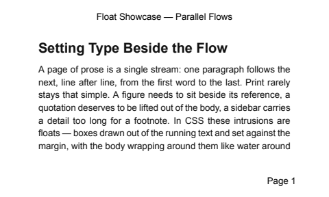 | 30.93% | 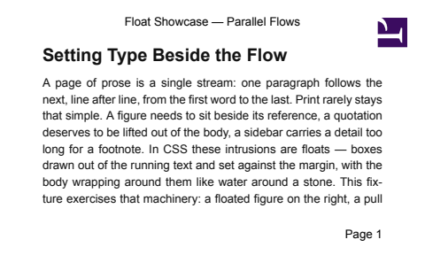 |
|  | 23.49% | 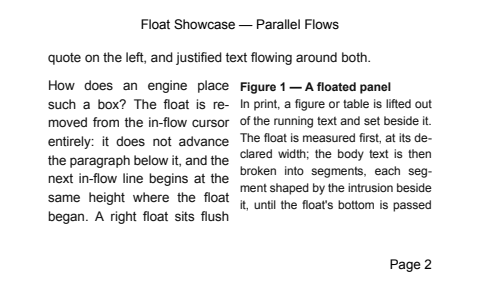 |
| 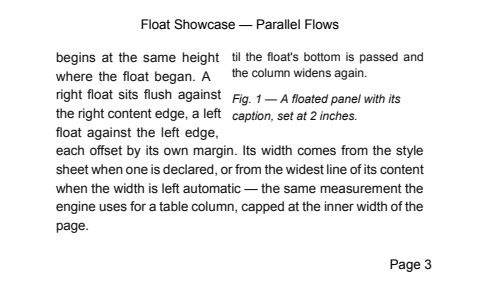 | 20.97% | 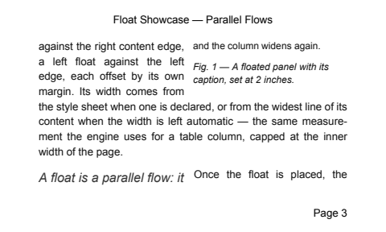 |
|  | 22.51% |  |
| 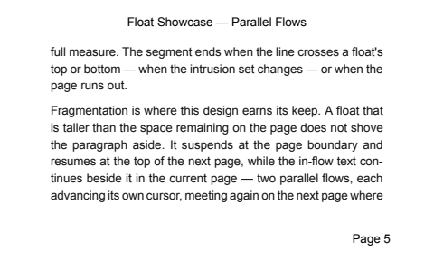 | 22.36% |  |
| 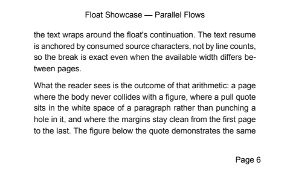 | 24.14% |  |
| 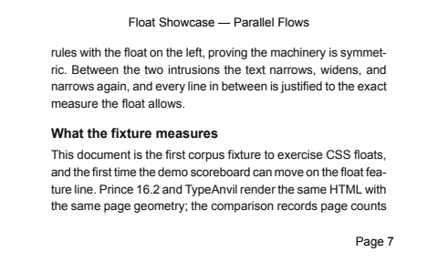 | 22.57% | 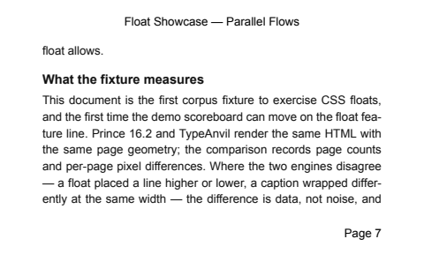 |
| 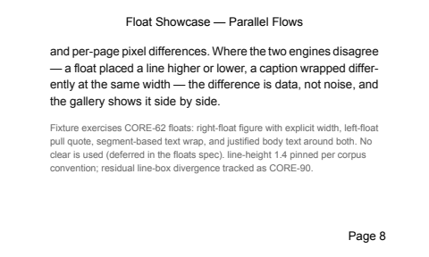 | 18.22% | 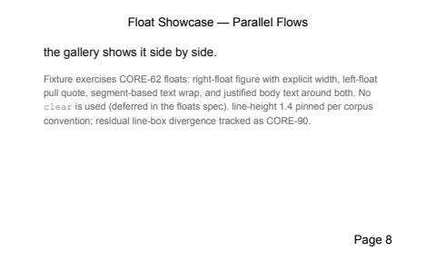 |

<a id="invoice-statement-html"></a>

### Invoice — Statement of Account — `invoice-statement.html`

**Tables Fragmentation** · **Paged Media CSS** · **Fragmentation**

TypeAnvil 5 page(s) · Prince 5 page(s) · overall diff 27.69% (missing-feature)

**Known limitations**

- border-collapse: separate + border-spacing unsupported (collapse only)
- rowspan unsupported (not used)
- two fragmenting tables in one document (sections A and B); each repeats its own header row per page

**Expected deltas vs Prince**

- Prince may resolve a different system font for the sans-serif stack
- Running-header font pinned to Arial 8pt in both engines; residual header diffs are layout-metric or structural
- Section B's running balance is static text, not a computed counter, so both engines print identical digits
- Currency symbols and accented glyphs (Zürich, Säntis) exercise the ToUnicode path; a glyph-substitution difference would show as per-page pixel noise

| TypeAnvil | Diff | Prince |
|---|---|---|
| 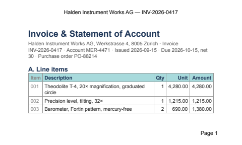 | 24.83% | 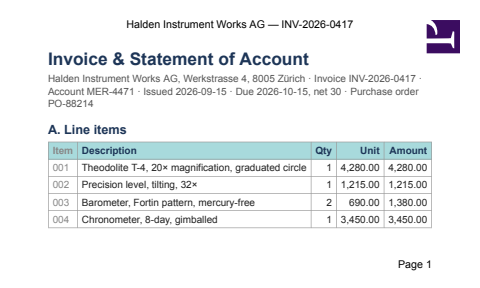 |
| 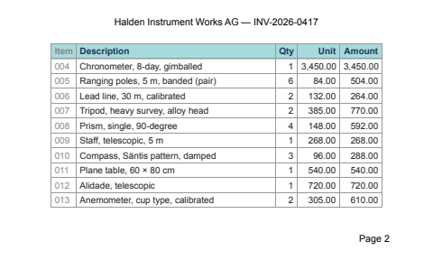 | 25.86% | 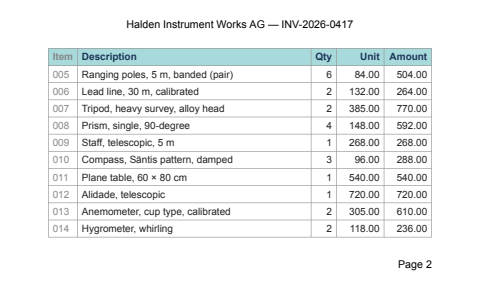 |
| 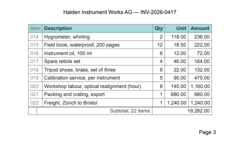 | 24.61% | 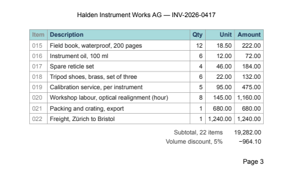 |
| 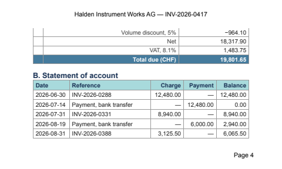 | 29.67% | 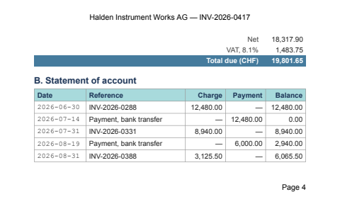 |
| 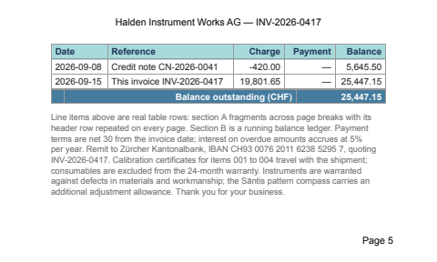 | 33.48% | 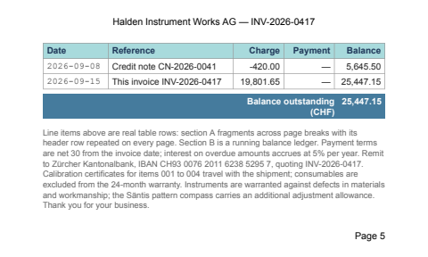 |

<a id="invoice-html"></a>

### Invoice — `invoice.html`

**Tables Fragmentation** · **Paged Media CSS**

TypeAnvil 5 page(s) · Prince 5 page(s) · overall diff 17.12% (cosmetic)

**Known limitations**

- border-collapse: separate + border-spacing unsupported (collapse only)
- rowspan unsupported (not used)

**Expected deltas vs Prince**

- Prince may resolve a different system font for the sans-serif stack
- Prince's default table-cell padding may differ from TypeAnvil's explicit padding
- Total row repeats at the bottom of every page (CORE-96, Prince parity)

| TypeAnvil | Diff | Prince |
|---|---|---|
| 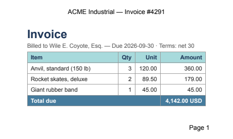 | 16.15% | 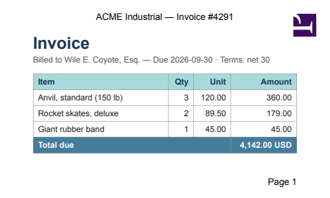 |
| 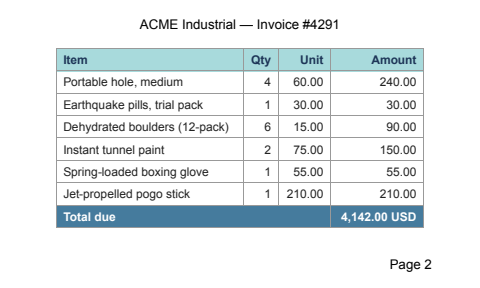 | 20.10% | 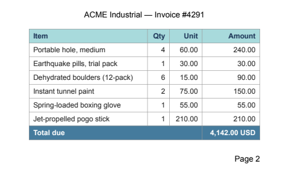 |
| 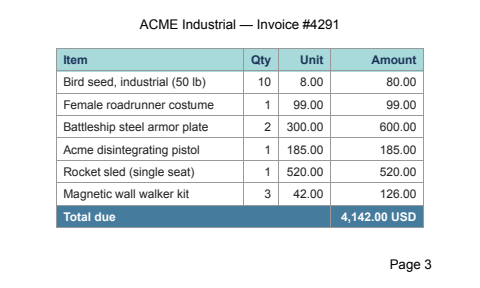 | 20.57% | 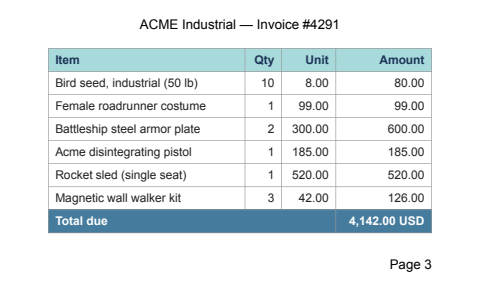 |
| 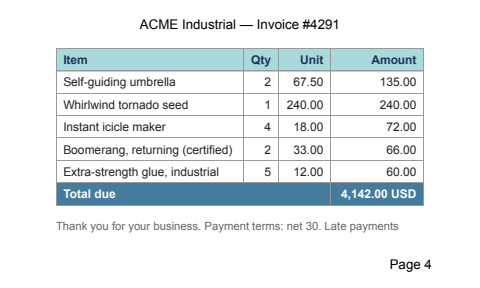 | 19.84% | 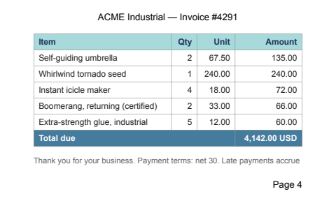 |
|  | 8.92% |  |

<a id="letterhead-html"></a>

### Letterhead — `letterhead.html`

**Paged Media CSS** · **Fragmentation**

TypeAnvil 8 page(s) · Prince 8 page(s) · overall diff 12.26% (cosmetic)

**Expected deltas vs Prince**

- Margin-box fonts pinned to Arial 10pt (CORE-86); cover page margin boxes are content: none
- Prince may apply default margins to @page cover differently

| TypeAnvil | Diff | Prince |
|---|---|---|
| 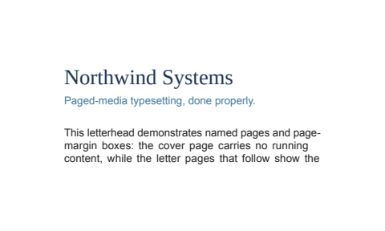 | 16.22% |  |
|  | 18.64% |  |
|  | 2.52% |  |
| 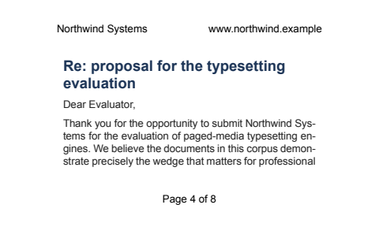 | 12.08% |  |
| 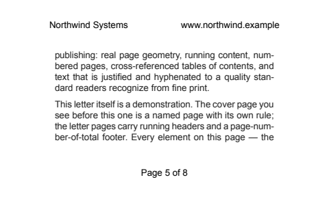 | 15.66% |  |
| 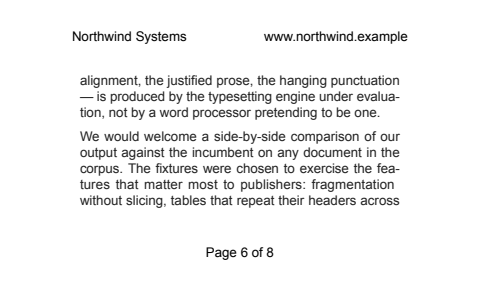 | 16.52% | 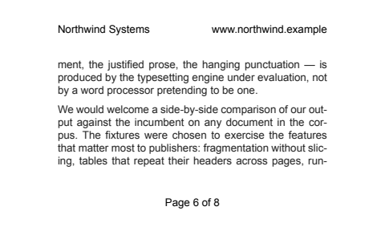 |
| 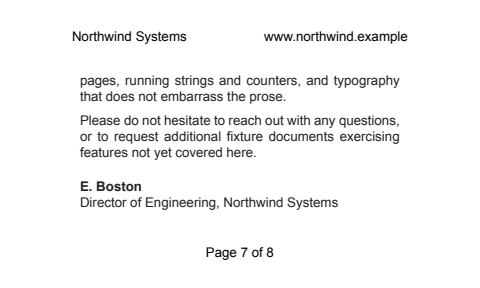 | 10.77% |  |
| 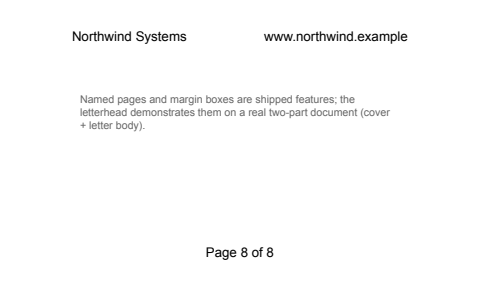 | 5.64% | 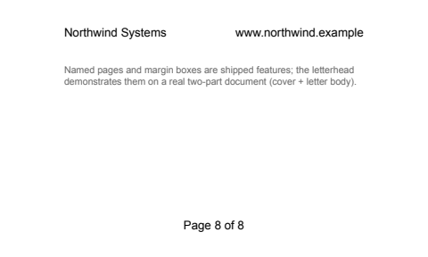 |

<a id="paper-html"></a>

### Academic Paper — `paper.html`

**Typography Layer** · **Fragmentation** · **Footnotes**

TypeAnvil 12 page(s) · Prince 11 page(s) · **page count mismatch** · overall diff 23.52% (missing-feature)

**Known limitations**

- footnote styling is fixed (9pt marker-hang layout; fixture pins color/size via .fn)
- CSS float placement unsupported (known gap; no floats used)

**Expected deltas vs Prince**

- Hyphenation points may differ (different hyphenation dictionaries)
- Justification glue distribution may differ slightly at identical widths
- line-height pinned to 1.5 (CORE-75) to exercise CORE-74 convergence; page counts match Prince at 1.5 (11 = 11)
- Footnote band height may differ where note text wraps differently (CORE-107)

| TypeAnvil | Diff | Prince |
|---|---|---|
|  | 26.69% | 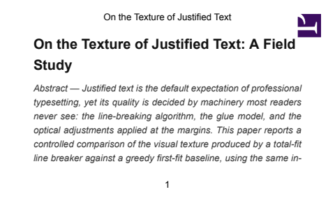 |
| 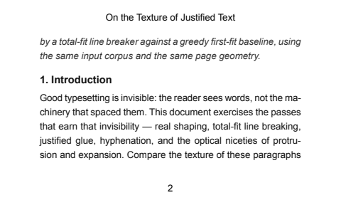 | 19.19% | 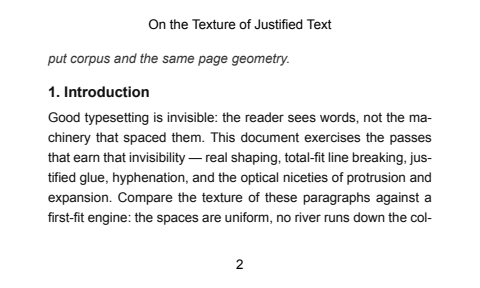 |
| 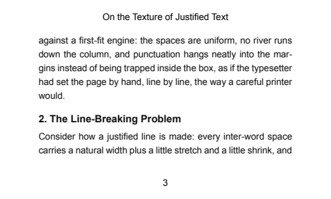 | 20.15% | 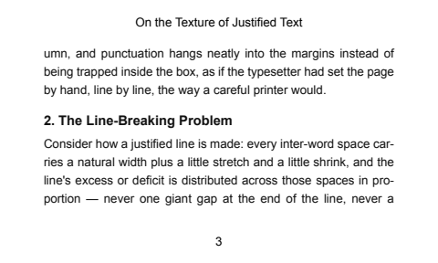 |
| 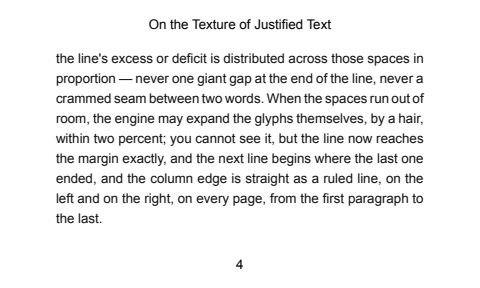 | 23.13% |  |
| 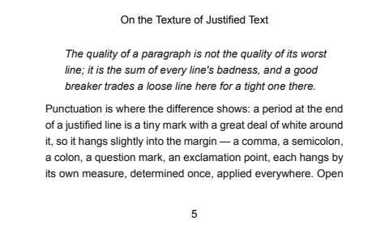 | 26.79% |  |
| 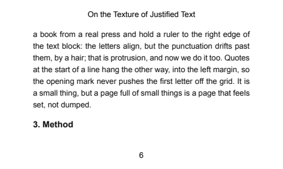 | 20.04% | 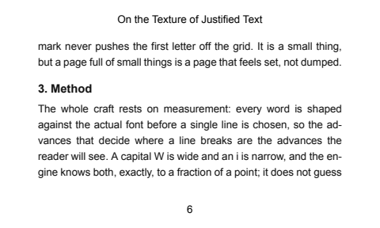 |
| 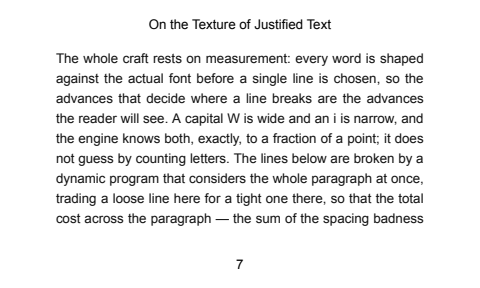 | 22.87% |  |
| 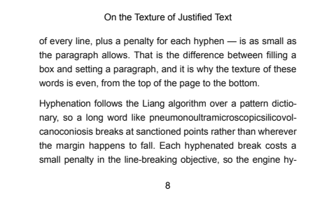 | 27.52% |  |
|  | 25.98% | 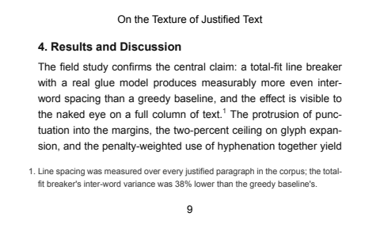 |
| 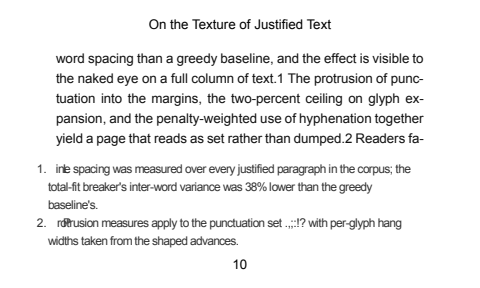 | 24.68% |  |
|  | 21.70% |  |
|  | — | — |

<a id="prose-html"></a>

### Prose Showcase — `prose.html`

**Typography Layer** · **Fragmentation**

TypeAnvil 11 page(s) · Prince 11 page(s) · overall diff 20.40% (missing-feature)

**Known limitations**

- none for the demonstrated features

**Expected deltas vs Prince**

- Hyphenation points may differ (different hyphenation dictionaries)
- Font metrics differences shift exact break positions
- Prince does not implement Knuth-Plass protrusion to the same spec
- line-height pinned to 1.6 (CORE-75) to exercise CORE-74 convergence; page-count slope still diverges at 1.6 (tracked as CORE-90)

| TypeAnvil | Diff | Prince |
|---|---|---|
|  | 25.01% |  |
|  | 18.34% |  |
|  | 18.50% |  |
|  | 24.19% |  |
|  | 21.53% |  |
|  | 25.95% |  |
|  | 20.37% |  |
|  | 21.16% |  |
|  | 17.59% |  |
|  | 25.45% |  |
|  | 6.35% |  |

<a id="report-html"></a>

### Quarterly Report — `report.html`

**Paged Media CSS** · **Fragmentation** · **Tables Fragmentation**

TypeAnvil 11 page(s) · Prince 11 page(s) · overall diff 14.29% (cosmetic)

**Known limitations**

- string-set limited to the content() of h1

**Expected deltas vs Prince**

- TOC dotted leaders may use slightly different dot spacing
- Running-header font pinned to Arial 10pt in both engines (CORE-86); residual header diffs are layout-metric or structural
- Prince may hyphenate differently in table cells

| TypeAnvil | Diff | Prince |
|---|---|---|
|  | 9.06% |  |
|  | 17.51% |  |
|  | 16.77% |  |
|  | 15.25% |  |
|  | 12.14% |  |
|  | 17.87% |  |
|  | 6.79% |  |
|  | 25.89% |  |
|  | 15.43% |  |
|  | 17.11% |  |
|  | 3.41% |  |

<a id="table-stress-html"></a>

### Inventory Ledger — Table Fragmentation Stress — `table-stress.html`

**Tables Fragmentation** · **Fragmentation** · **Paged Media CSS**

TypeAnvil 47 page(s) · Prince 45 page(s) · **page count mismatch** · overall diff 22.21% (missing-feature)

**Known limitations**

- border-collapse: separate + border-spacing unsupported (collapse only)
- rowspan unsupported (not used)

**Expected deltas vs Prince**

- Frozen column widths match Prince within ~0.4-6pt (CORE-96); residual from font metrics and Prince's ~7.7pt right-edge table overflow
- Page-break positions may differ where a row's height differs between engines
- Total row repeats at the bottom of every page (CORE-96, Prince parity)

| TypeAnvil | Diff | Prince |
|---|---|---|
|  | 25.64% |  |
|  | 23.54% |  |
|  | 19.60% |  |
|  | 24.23% |  |
|  | 23.83% |  |
|  | 22.51% |  |
|  | 23.84% |  |
|  | 23.33% |  |
|  | 21.09% |  |
|  | 21.24% |  |
|  | 23.35% |  |
|  | 21.80% |  |
|  | 25.06% |  |
|  | 21.01% |  |
|  | 20.75% |  |
|  | 21.27% |  |
|  | 24.84% |  |
|  | 24.33% |  |
|  | 23.62% |  |
|  | 22.69% |  |
|  | 20.60% |  |
|  | 19.65% |  |
|  | 20.07% |  |
|  | 24.02% |  |
|  | 22.59% |  |
|  | 21.64% |  |
|  | 21.05% |  |
|  | 22.35% |  |
|  | 20.83% |  |
|  | 25.35% |  |
|  | 21.44% |  |
|  | 18.51% |  |
|  | 18.75% |  |
|  | 24.64% |  |
|  | 18.03% |  |
|  | 24.10% |  |
|  | 19.68% |  |
|  | 20.59% |  |
|  | 23.86% |  |
|  | 23.78% |  |
|  | 24.49% |  |
|  | 18.11% |  |
|  | 23.48% |  |
|  | 24.86% |  |
|  | 19.50% |  |
|  | — | — |
|  | — | — |

## Benchmark — engine gaps

One fixture per engine gap, rendered with the current engine at the comparison geometry. **Open** fixtures show a gap the engine still has; **closed** fixtures are kept as regression evidence after their issue landed. Separate from the public comparison corpus above.

### Open gaps

#### Per-side border colours — `bench/per-side-border-colors.html`

Status: **pending** · tracked in [CORE-201](https://linear.app/whitelodge/issue/CORE-201)

**Expectation:** four differently coloured border sides: red top, green right, blue bottom, black left

- verified 2026-09-15 on the release build: TypeAnvil paints one black ring (5091 px of black, 0 px of any declared side colour); Prince paints all four (red 1592, green 512, blue 1386, black 1377)
- the per-side longhands are overwritten by the border-color shorthand, so every side repaints with one colour


#### Image inside a table cell — `bench/table-cell-image.html`

Status: **pending** · tracked in [CORE-210](https://linear.app/whitelodge/issue/CORE-210)

**Expectation:** the image in the table cell paints, exactly as the same image does in the plain block below it

- verified 2026-09-15 on the release build: page 1 (cell copy) paints 0 pixels while page 2 (block control) paints the full tile
- the control tile in the same document proves the asset resolves and decodes, so the missing tile isolates the table-cell layout path
- rendered through TypeAnvil only, which is what this layer uses; the fixture's asset path is CWD-relative because TypeAnvil resolves src against the process CWD


### Closed — regression fixtures

#### Margin-box per-box declarations — `bench/margin-box-decls.html`

Status: **resolved** · tracked in [CORE-141](https://linear.app/whitelodge/issue/CORE-141)

**Expectation:** top-center margin box renders with its own font (monospace 12pt), color, bottom border, and vertical-align

- resolved on release/2026.9 (CORE-141 landed)
- re-verified 2026-09-15 in this render: the header band contains the declared colour #1d3557 (192 px) and the declared bottom rule #457b9d (175 px), which the pre-fix engine dropped
- pre-fix behaviour was a fixed 10pt Arial box with name-derived alignment, no color, no border


#### Monolithic overflow — `bench/monolithic-overflow.html`

Status: **resolved** · tracked in [CORE-143](https://linear.app/whitelodge/issue/CORE-143)

**Expectation:** oversized absolutely-positioned block paints once on page 1, never re-painted on continuation pages

- resolved on release/2026.9 (CORE-143 landed): the marker text appears once and the document renders a single page at this geometry
- weak fixture as written: one page means the continuation-page half of the expectation is not exercised. Strengthening it means making the positioned box genuinely taller than one page's content box


#### Page-context viewport units — `bench/page-context-vh.html`

Status: **resolved** · tracked in [CORE-140](https://linear.app/whitelodge/issue/CORE-140)

**Expectation:** 100vw x 10vh band resolves against the 5in x 3in page box (band height 21.6pt), not the stylo 1024x768 viewport

- resolved on release/2026.9 (CORE-140 landed)
- re-verified 2026-09-15 in this render: the band measures ~30 px at 96 DPI, i.e. ~0.31in against the expected 0.3in (10vh of the 3in page box). The pre-fix figure was ~77 px, resolved from the fixed 1024x768 viewport


#### Page floats — `bench/page-floats.html`

Status: **resolved** · tracked in [CORE-130](https://linear.app/whitelodge/issue/CORE-130)

**Expectation:** float: top box pins to the top of its page's content box, full width, body text below

- resolved on release/2026.9 (CORE-130 landed: float: top/bottom/next-page/snap edge bands)
- re-verified 2026-09-15 in this render: the box occupies the top band at full content width (cols 56-423) and every following text line starts at the left content edge and spans full width, so no text wraps beside a side float
- pre-fix behaviour was a fallback to an inline left float, which would leave the following lines wrapping beside the box


