<!-- BEGIN GENERATED GALLERY — build-demo.sh rewrites from here; do not edit below -->

## Comparison gallery — TypeAnvil vs Prince

Static, offline gallery. TypeAnvil renders on the left; Prince on the right. Engines: TypeAnvil `cb98dc5` · Prince 16.2. Geometry: 5in × 3in pages, 0.5in margins, 96 DPI raster.

> This section is REGENERATED by `scripts/build-demo.sh`. The preamble above is hand-maintained; edit it there, not here.

## Scoreboard

| Document | TypeAnvil | Prince | Overall diff | Bucket |
|---|---|---|---|---|
| [Float Showcase — Figure &amp; Pull Quote](#float-showcase-html) | 8 | 8 | 20.88% | missing-feature |
| [Invoice](#invoice-html) | 5 | 5 | 19.17% | cosmetic |
| [Letterhead](#letterhead-html) | 8 | 8 | 7.86% | cosmetic |
| [Academic Paper](#paper-html) | 11 | 11 | 13.81% | cosmetic |
| [Prose Showcase](#prose-html) | 11 | 11 | 10.52% | cosmetic |
| [Quarterly Report](#report-html) | 11 | 11 | 7.51% | cosmetic |
| [Inventory Ledger — Table Fragmentation Stress](#table-stress-html) | 43 | 45 | 20.94% | missing-feature |

### Float Showcase — Figure &amp; Pull Quote — `float-showcase.html`

**CSS Floats** · **Fragmentation** · **Typography Layer**

TypeAnvil 8 page(s) · Prince 8 page(s) · overall diff 20.88% (missing-feature)

**Known limitations**

- clear unsupported (floats spec Non-Goals; no clear declarations used)
- one float per side per y-band (simplified stacking; fixture uses at most one per side)

**Expected deltas vs Prince**

- Prince may resolve a different system font for the sans-serif stack
- Float placement may differ by a line where line-box heights diverge (CORE-90)
- Prince hyphenation dictionary may differ inside float-wrapped segments
- Page-count gap (TA 11 vs PR 8) attributed in CORE-93: UA body margin 8px narrows lines (CORE-95, engine) + hyphenation density (CORE-53 scope)

| TypeAnvil | Diff | Prince |
|---|---|---|
|  | 12.54% |  |
| 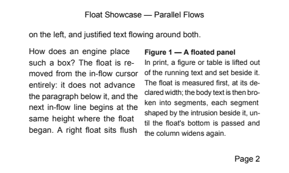 | 13.49% |  |
|  | 19.24% |  |
| 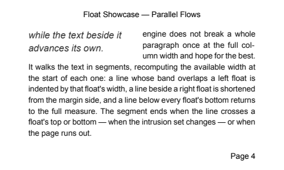 | 22.58% | 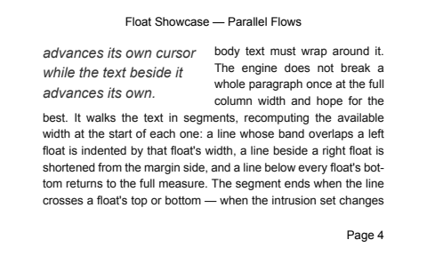 |
| 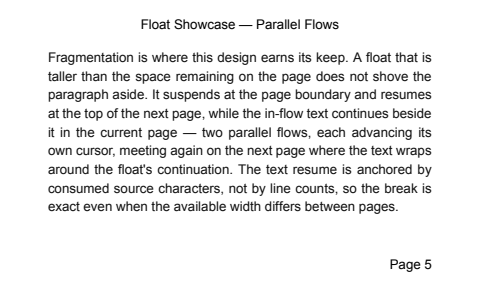 | 31.71% | 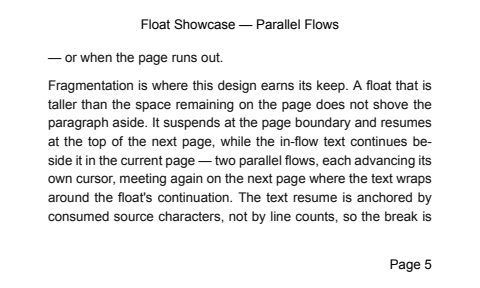 |
| 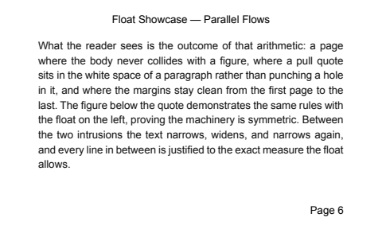 | 30.54% | 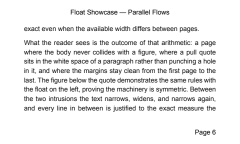 |
| 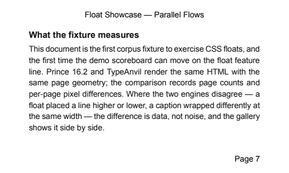 | 26.12% |  |
|  | 10.84% |  |

### Invoice — `invoice.html`

**Tables Fragmentation** · **Paged Media CSS**

TypeAnvil 5 page(s) · Prince 5 page(s) · overall diff 19.17% (cosmetic)

**Known limitations**

- border-collapse: separate + border-spacing unsupported (collapse only)
- rowspan unsupported (not used)

**Expected deltas vs Prince**

- Prince may resolve a different system font for the sans-serif stack
- Prince's default table-cell padding may differ from TypeAnvil's explicit padding
- Total row repeats at the bottom of every page (CORE-96, Prince parity)

| TypeAnvil | Diff | Prince |
|---|---|---|
| 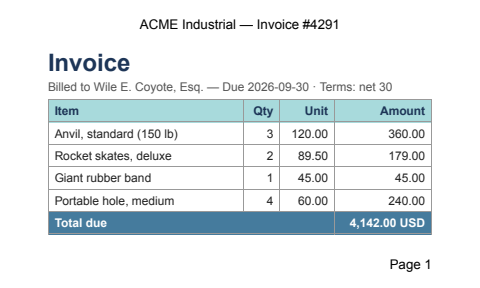 | 22.51% |  |
| 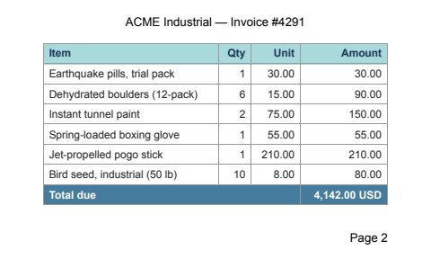 | 19.36% |  |
|  | 19.36% |  |
| 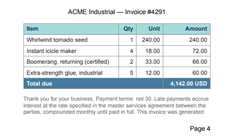 | 26.91% |  |
| 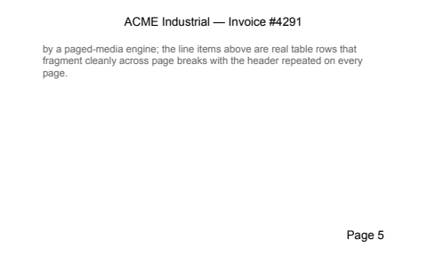 | 7.74% | 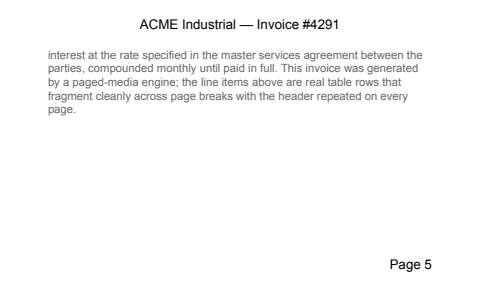 |

### Letterhead — `letterhead.html`

**Paged Media CSS** · **Fragmentation**

TypeAnvil 8 page(s) · Prince 8 page(s) · overall diff 7.86% (cosmetic)

**Expected deltas vs Prince**

- Margin-box fonts pinned to Arial 10pt (CORE-86); cover page margin boxes are content: none
- Prince may apply default margins to @page cover differently

| TypeAnvil | Diff | Prince |
|---|---|---|
| 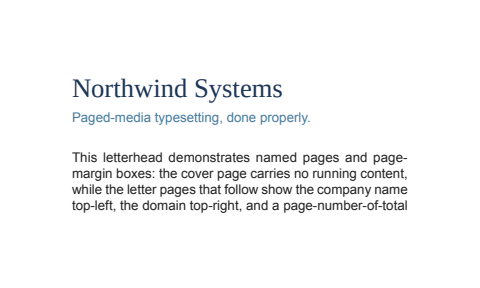 | 8.22% | 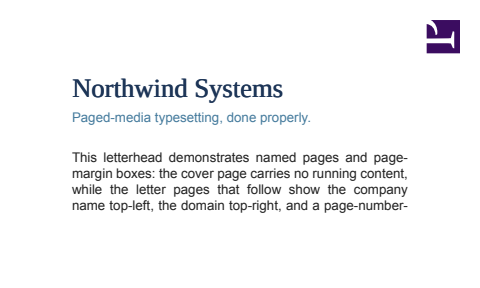 |
| 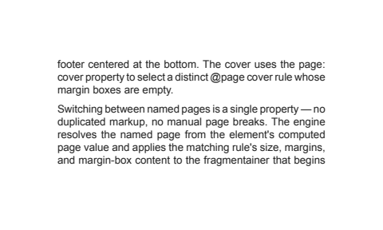 | 17.45% | 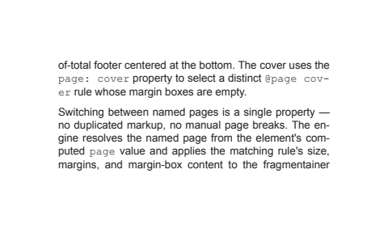 |
| 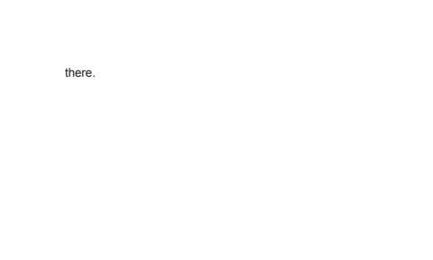 | 0.50% |  |
|  | 5.49% | 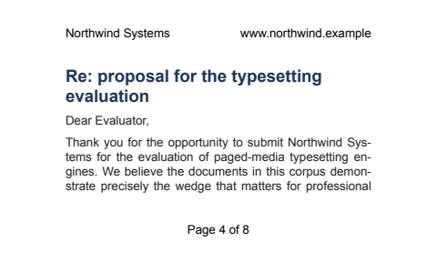 |
| 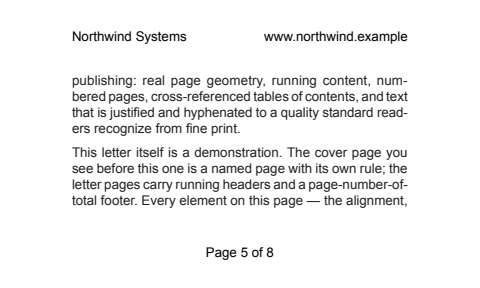 | 12.24% | 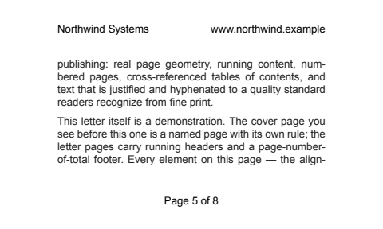 |
| 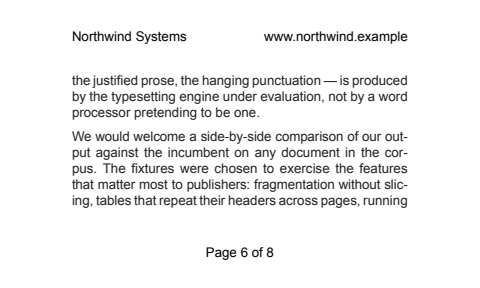 | 11.90% |  |
| 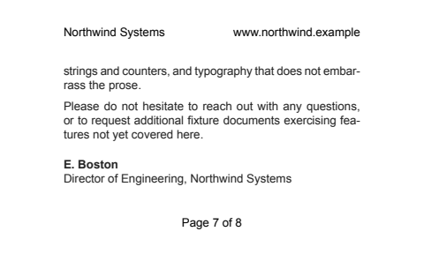 | 6.20% | 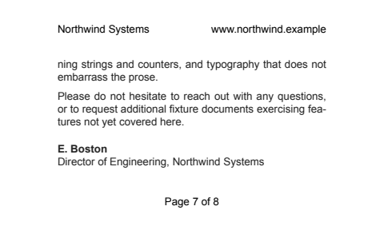 |
|  | 0.88% |  |

### Academic Paper — `paper.html`

**Typography Layer** · **Fragmentation** · **Footnotes**

TypeAnvil 11 page(s) · Prince 11 page(s) · overall diff 13.81% (cosmetic)

**Known limitations**

- footnote styling is fixed (9pt marker-hang layout; fixture pins color/size via .fn)
- CSS float placement unsupported (known gap; no floats used)

**Expected deltas vs Prince**

- Hyphenation points may differ (different hyphenation dictionaries)
- Justification glue distribution may differ slightly at identical widths
- line-height pinned to 1.5 (CORE-75) to exercise CORE-74 convergence; page counts match Prince at 1.5 (11 = 11)
- Footnote band height may differ where note text wraps differently (CORE-107)

| TypeAnvil | Diff | Prince |
|---|---|---|
| 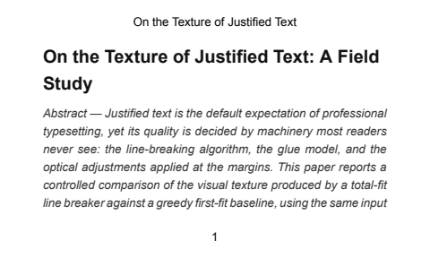 | 8.85% |  |
| 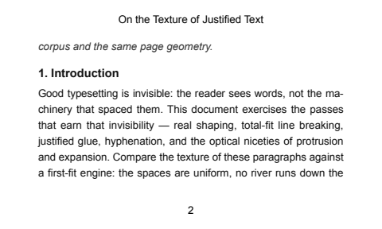 | 14.18% |  |
| 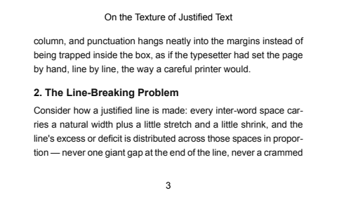 | 11.89% |  |
|  | 16.98% | 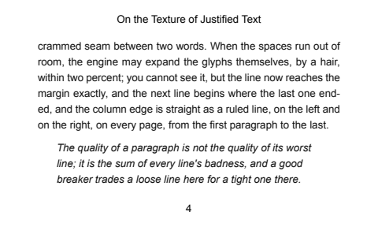 |
| 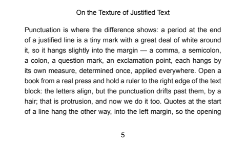 | 9.56% | 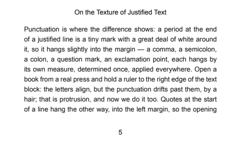 |
| 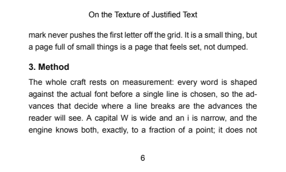 | 14.25% |  |
| 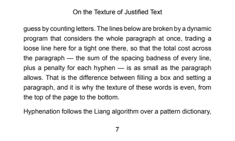 | 19.31% | 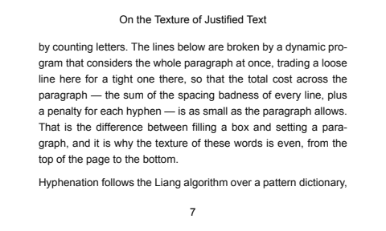 |
|  | 8.91% | 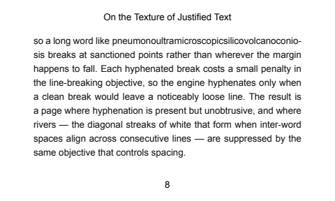 |
| 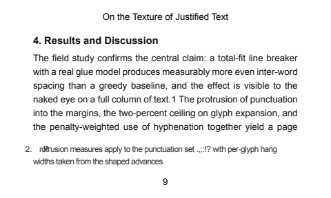 | 17.94% |  |
| 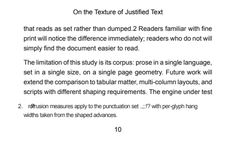 | 20.11% |  |
| 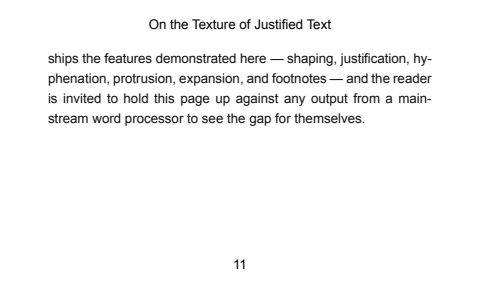 | 9.94% | 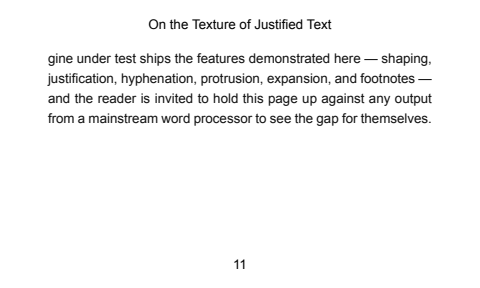 |

### Prose Showcase — `prose.html`

**Typography Layer** · **Fragmentation**

TypeAnvil 11 page(s) · Prince 11 page(s) · overall diff 10.52% (cosmetic)

**Known limitations**

- none for the demonstrated features

**Expected deltas vs Prince**

- Hyphenation points may differ (different hyphenation dictionaries)
- Font metrics differences shift exact break positions
- Prince does not implement Knuth-Plass protrusion to the same spec
- line-height pinned to 1.6 (CORE-75) to exercise CORE-74 convergence; page-count slope still diverges at 1.6 (tracked as CORE-90)

| TypeAnvil | Diff | Prince |
|---|---|---|
|  | 10.30% |  |
| 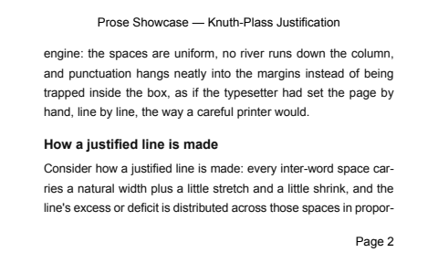 | 9.69% | 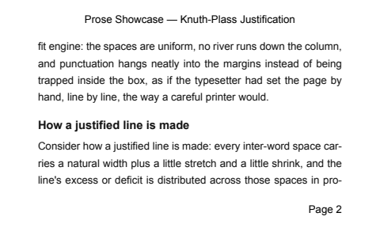 |
| 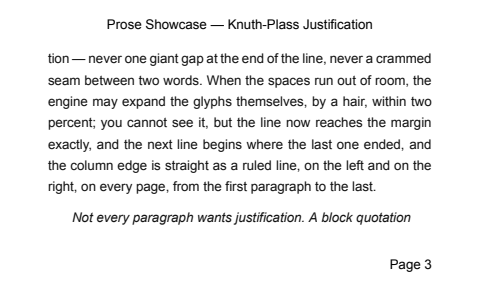 | 17.83% |  |
|  | 13.20% | 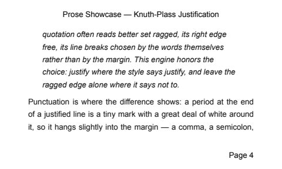 |
| 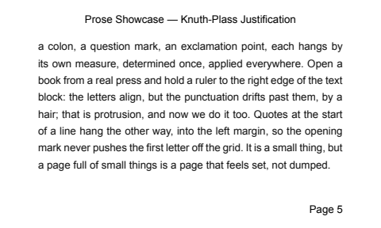 | 11.08% | 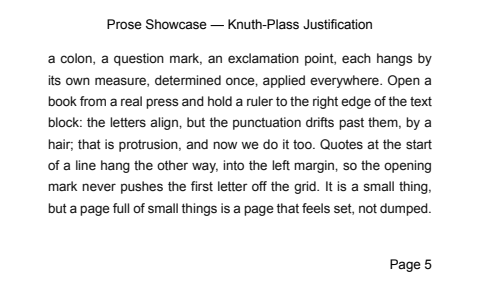 |
| 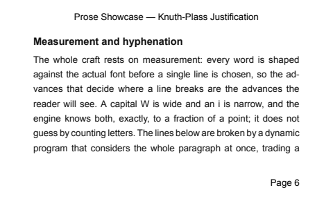 | 14.56% |  |
| 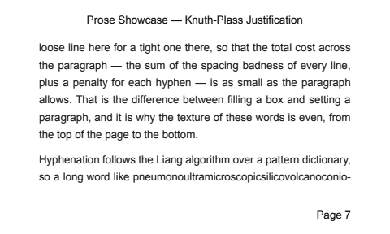 | 16.49% |  |
| 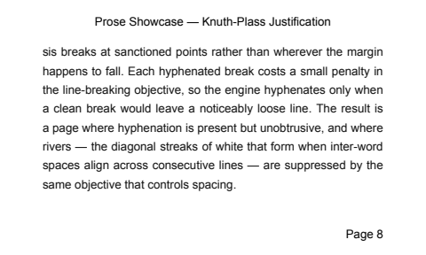 | 6.70% |  |
| 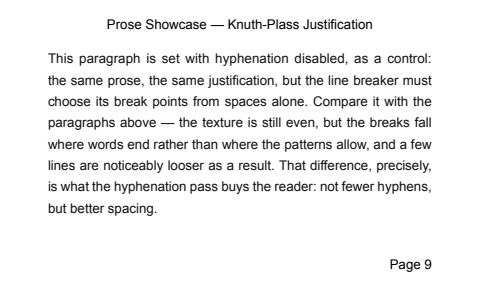 | 7.42% |  |
|  | 7.36% |  |
|  | 1.10% | 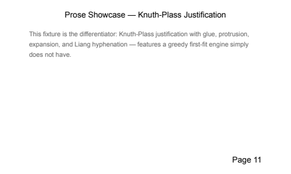 |

### Quarterly Report — `report.html`

**Paged Media CSS** · **Fragmentation** · **Tables Fragmentation**

TypeAnvil 11 page(s) · Prince 11 page(s) · overall diff 7.51% (cosmetic)

**Known limitations**

- string-set limited to the content() of h1

**Expected deltas vs Prince**

- TOC dotted leaders may use slightly different dot spacing
- Running-header font pinned to Arial 10pt in both engines (CORE-86); residual header diffs are layout-metric or structural
- Prince may hyphenate differently in table cells

| TypeAnvil | Diff | Prince |
|---|---|---|
| 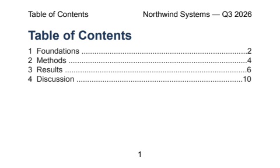 | 4.67% |  |
|  | 6.43% |  |
|  | 12.55% |  |
|  | 8.40% |  |
|  | 2.91% |  |
|  | 15.78% |  |
|  | 5.86% |  |
|  | 8.79% |  |
|  | 5.85% |  |
|  | 10.25% |  |
|  | 1.09% |  |

### Inventory Ledger — Table Fragmentation Stress — `table-stress.html`

**Tables Fragmentation** · **Fragmentation** · **Paged Media CSS**

TypeAnvil 43 page(s) · Prince 45 page(s) · **page count mismatch** · overall diff 20.94% (missing-feature)

**Known limitations**

- border-collapse: separate + border-spacing unsupported (collapse only)
- rowspan unsupported (not used)

**Expected deltas vs Prince**

- Frozen column widths match Prince within ~0.4-6pt (CORE-96); residual from font metrics and Prince's ~7.7pt right-edge table overflow
- Page-break positions may differ where a row's height differs between engines
- Total row repeats at the bottom of every page (CORE-96, Prince parity)

| TypeAnvil | Diff | Prince |
|---|---|---|
|  | 13.63% |  |
|  | 17.67% |  |
|  | 25.52% |  |
|  | 17.77% |  |
|  | 18.15% |  |
|  | 20.84% |  |
|  | 23.56% |  |
|  | 17.77% |  |
|  | 20.55% |  |
|  | 20.53% |  |
|  | 23.42% |  |
|  | 24.30% |  |
|  | 23.27% |  |
|  | 25.73% |  |
|  | 18.76% |  |
|  | 17.42% |  |
|  | 19.31% |  |
|  | 19.03% |  |
|  | 23.45% |  |
|  | 20.99% |  |
|  | 25.71% |  |
|  | 19.42% |  |
|  | 24.99% |  |
|  | 18.56% |  |
|  | 22.42% |  |
|  | 24.92% |  |
|  | 20.05% |  |
|  | 19.80% |  |
|  | 20.70% |  |
|  | 18.50% |  |
|  | 20.96% |  |
|  | 24.41% |  |
|  | 24.43% |  |
|  | 25.49% |  |
|  | 18.81% |  |
|  | 21.04% |  |
|  | 21.96% |  |
|  | 20.70% |  |
|  | 20.85% |  |
|  | 17.82% |  |
|  | 17.21% |  |
|  | 17.71% |  |
|  | 22.42% |  |
| — | — |  |
| — | — |  |

## Benchmark — open engine issues

One fixture per open issue, rendered with the current engine. These show known gaps on purpose; each flips to `resolved` as its issue lands. Separate from the public comparison corpus above.

### Margin-box per-box declarations — `bench/margin-box-decls.html`

Status: **pending** · tracked in [CORE-141](https://linear.app/whitelodge/issue/CORE-141)

**Expectation:** top-center margin box renders with its own font (monospace 12pt), color, bottom border, and vertical-align

- pre-CORE-141 the box renders 10pt Arial, name-derived alignment, no border

### Monolithic overflow — `bench/monolithic-overflow.html`

Status: **pending** · tracked in [CORE-143](https://linear.app/whitelodge/issue/CORE-143)

**Expectation:** oversized absolutely-positioned block paints once on page 1, never re-painted on continuation pages

### Page-context viewport units — `bench/page-context-vh.html`

Status: **pending** · tracked in [CORE-140](https://linear.app/whitelodge/issue/CORE-140)

**Expectation:** 100vw x 10vh band resolves against the 5in x 3in page box (band height 21.6pt), not the stylo 1024x768 viewport

- pre-CORE-140 the band height computes ~57.6pt from the fixed viewport

### Page floats — `bench/page-floats.html`

Status: **pending** · tracked in [CORE-130](https://linear.app/whitelodge/issue/CORE-130)

**Expectation:** float: top box pins to the top of its page's content box, full width, body text below

- pre-CORE-130 float: top falls back to an inline left float

