<!-- BEGIN GENERATED SHOWCASE -->

## Showcase — print-resolution renders (US Letter @ 300 DPI)

Realistic-size pages rendered by the TypeAnvil engine only (commit `83238b3`). The side-by-side comparison gallery lives in [the main demo README](../README.md) and runs at 5in × 3in @ 96 DPI so diffs stay cheap; these pages show the same engine at the geometry documents actually print at. Prince renders only the comparison pipeline — the showcase is a TypeAnvil output gallery, not a diff target.

### Book Sample

*Exercises:* paged-media-css, cross-references, fragmentation-core

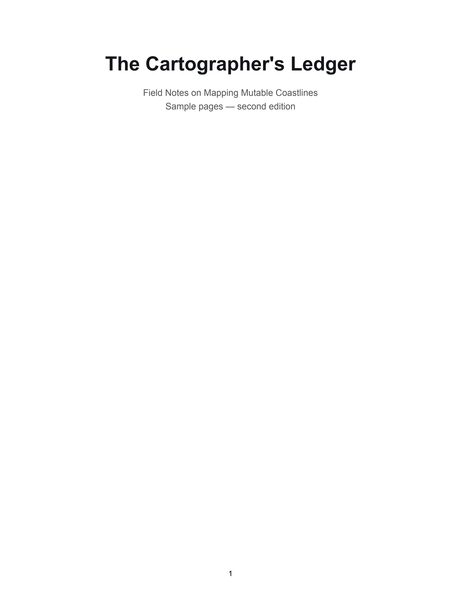
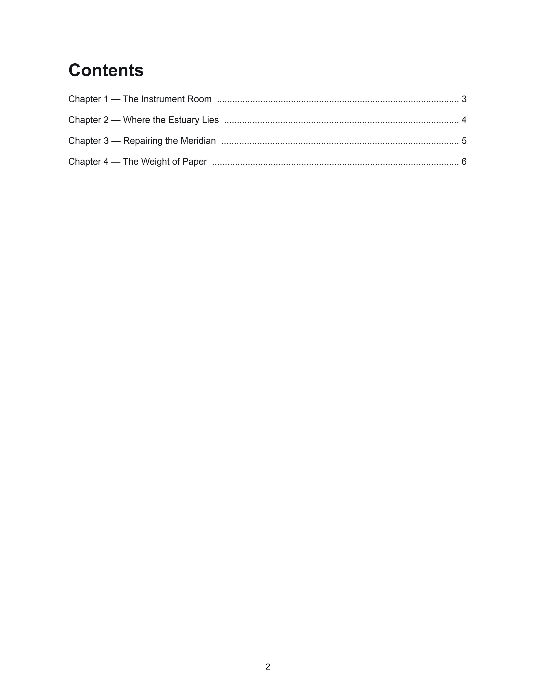
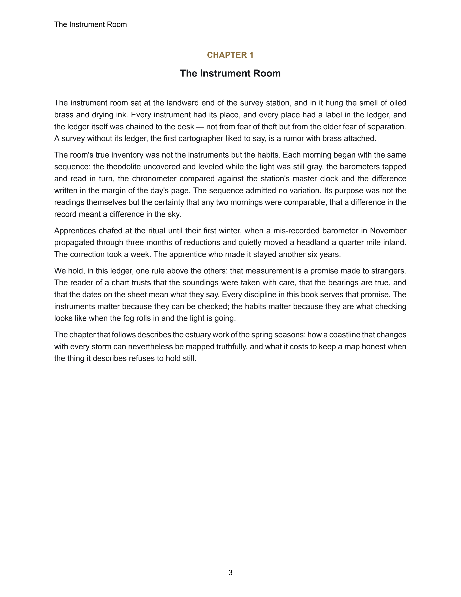
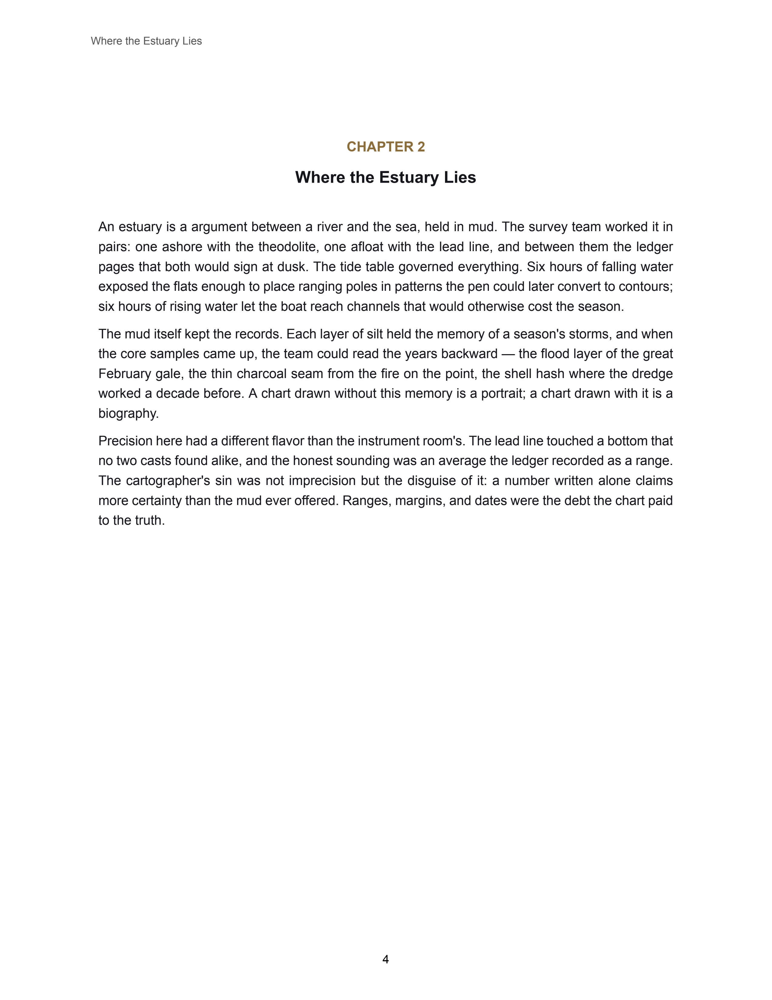
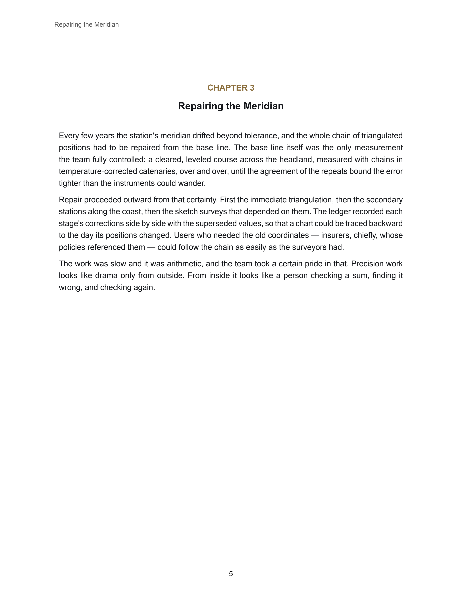
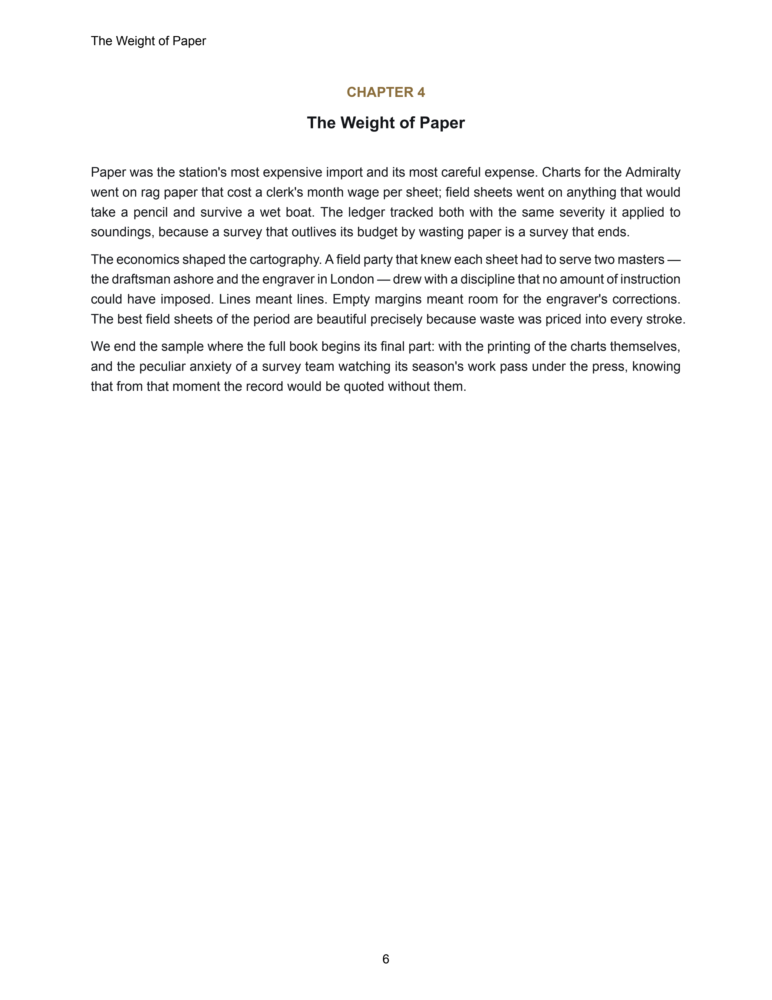

### Academic Sample

*Exercises:* typography-layer, fragmentation-core, footnotes, cross-references

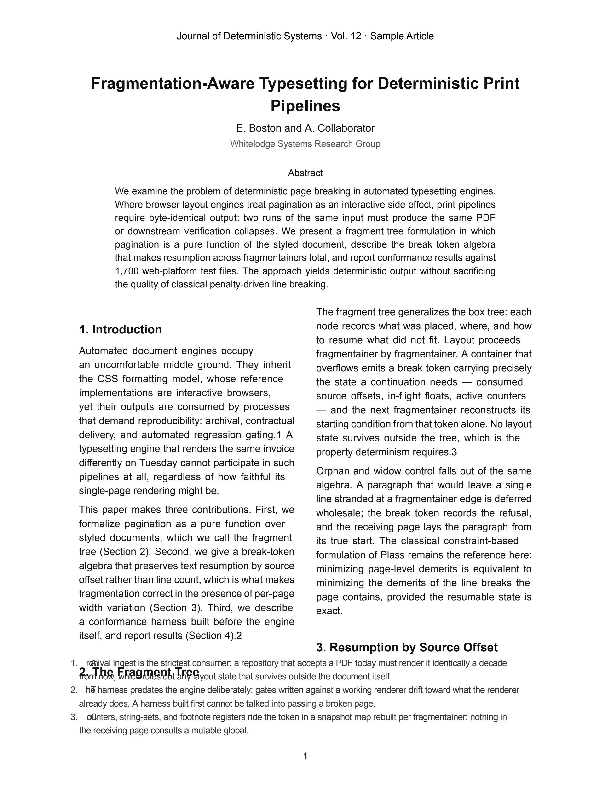
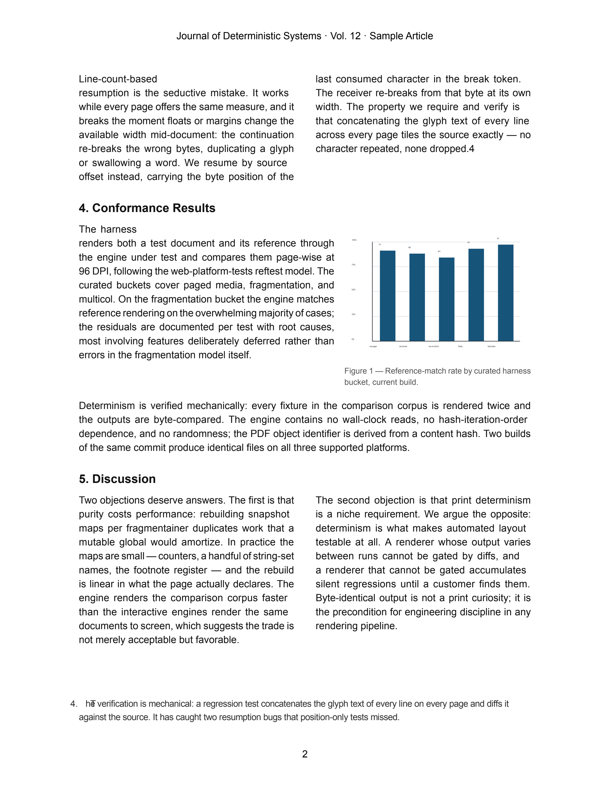
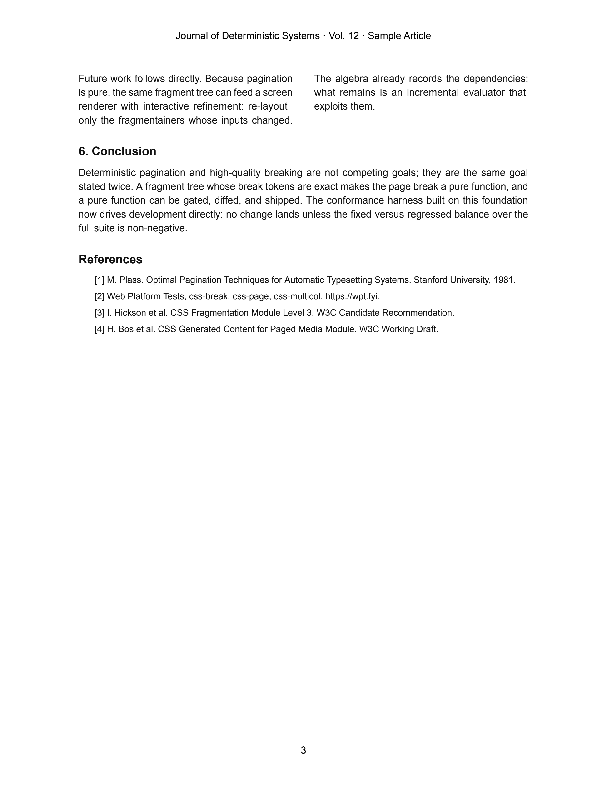

### Rich Media Print

*Exercises:* images, paged-media-css

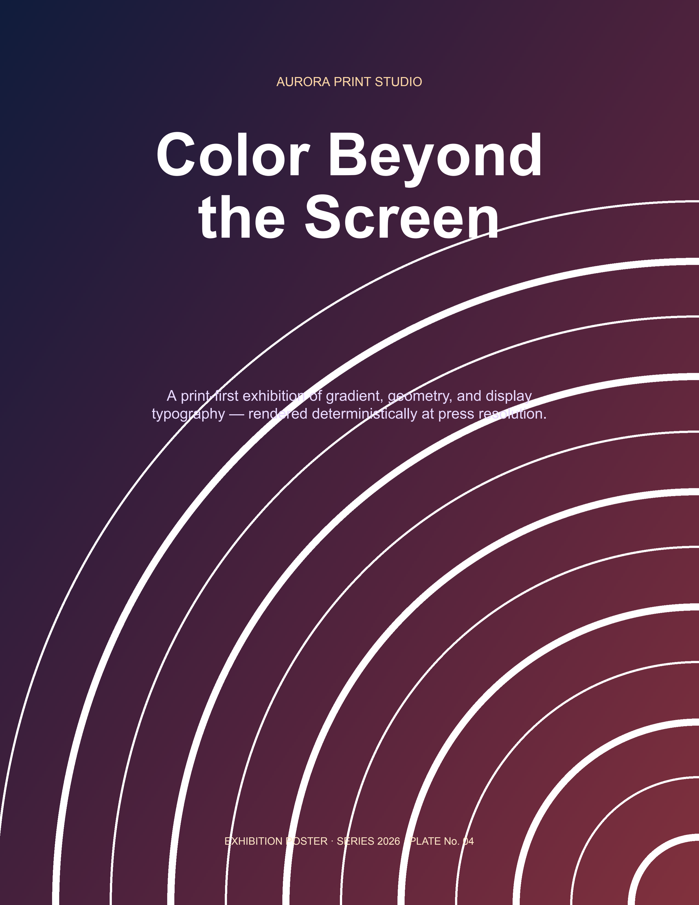

### Technical Report

*Exercises:* paged-media-css, fragmentation-core, tables-fragmentation, images

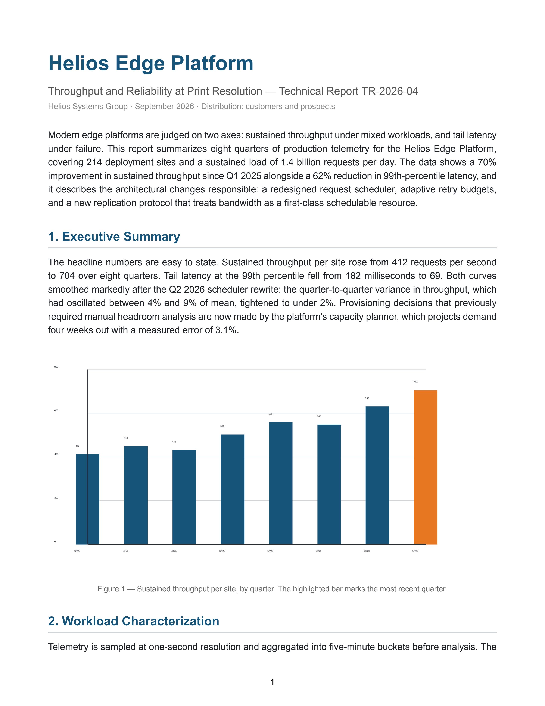
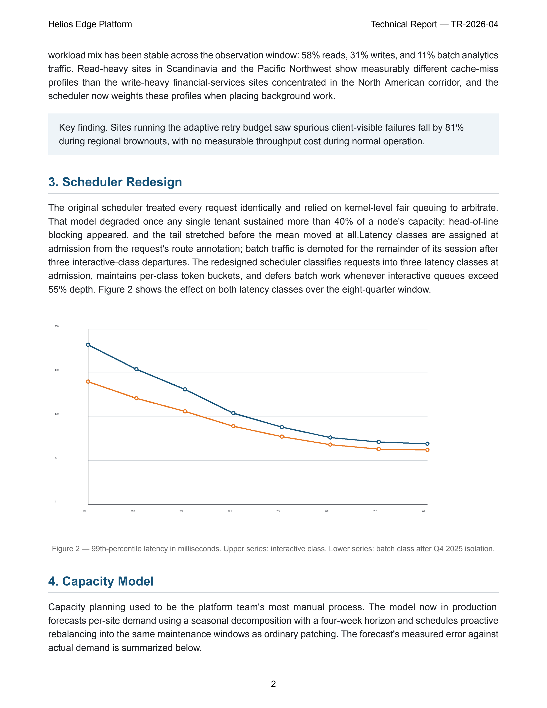
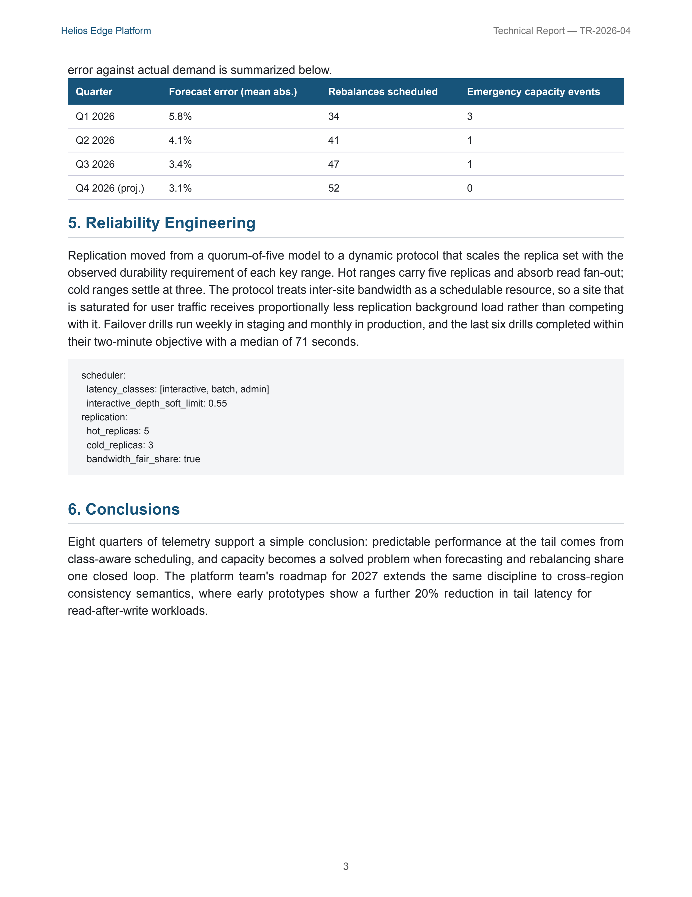
