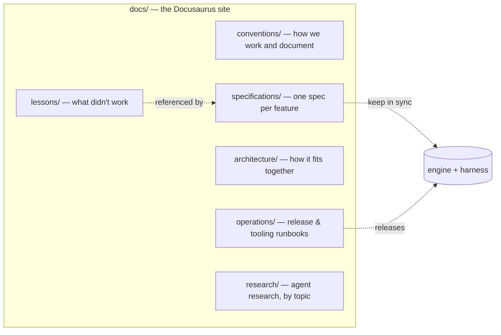

# Typeanvil Documentation

The single source of truth for how Typeanvil works, how it is built, and how to
operate it. Want to know how a feature behaves? Read its spec. Releasing? Read
the runbook. Surprised by something? Write a lesson.

## Map

| Folder | Purpose |
|---|---|
| `conventions/` | How we work and how we document |
| `specifications/` | One spec per feature — the implementation contract |
| `architecture/` | How the system fits together and why |
| `operations/` | Runbooks: release, deploy, tooling |
| `lessons/` | What didn't work, and what to do instead |
| `research/` | Research done by agents, categorized by directory |

## Start here

1. `conventions/doc-conventions.md` — the rules of this directory
2. `conventions/frontmatter-schema.md` — the frontmatter every doc must carry
3. `specifications/` — the features, one file each
4. `research/` — what we've studied, topic by topic

## Not in this directory

- **User-changeable configuration** → product docs / in-app help. Internal docs
  describe the code, not the user's knobs.
- **Transient AI task prompts** → `prompts/` at the repo root.
- **Strategy, market, and product decisions** → Obsidian vault
  (`brain/Projects/Typeanvil/`). The vault holds strategy; `docs/` holds
  engineering truth. Research reports produced by agents go in
  `docs/research/`, not the vault.
