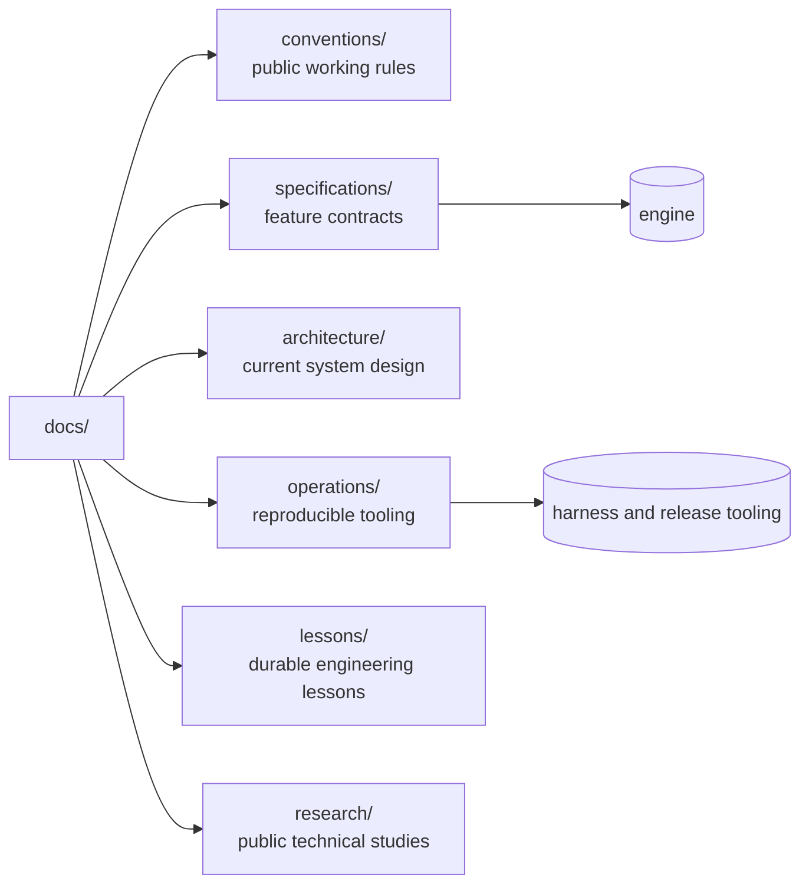

# Typeanvil Documentation

This site documents the Typeanvil engine and its tooling. It is written for
users, contributors, and AI agents who have access to the public repository and
public web resources.

The current behavior baseline is the `release/2026.9` branch. That branch is
the integration line for the current release. Promotion to `main` follows the
release gate and release procedure.

## Start here

| Reader | Start with |
|---|---|
| User | [CLI reference](operations/cli.md), [architecture](architecture/overview.md), and the repository `README.md` |
| Contributor | [development guidelines](conventions/development-guidelines.md), [documentation conventions](conventions/doc-conventions.md), and the [WPT harness](specifications/wpt-conformance-harness.spec.md) |
| AI agent | `AGENTS.md`, [documentation conventions](conventions/doc-conventions.md), and the relevant feature specification |

## Map



## Documentation sections

- [Architecture](architecture/overview.md) — engine pipeline, module
  boundaries, fragmentation, PDF output, and test tooling.
- [Conventions](conventions/doc-conventions.md) — public working rules and the
  documentation boundary.
- [Specifications](specifications/fragmentation-core.spec.md) — behavior contracts and
  acceptance criteria.
- [Operations](operations/cli.md) — CLI, container, harness, release, and
  docs-site runbooks.
- [Lessons](lessons/engine-layout.md) — durable engineering lessons.
- [Research](research/wpt-harness/typeanvil-wpt-harness-brief.md) — cited
  research that remains useful to public readers.

## Public documentation boundary

The repository contains stable technical information. Temporary issue triage,
private project coordination, product strategy, raw probes, and machine-specific
paths belong in an external note store. Repository docs must stand alone and
must not require access to private trackers, vaults, or local files.

See [Documentation Conventions](conventions/doc-conventions.md) for the complete
boundary and lifecycle rules.

## Site development

The Docusaurus site reads content from this directory. To run it locally:

```bash
cd docsite
npm run start
```

See [the docs-site runbook](operations/docs-site.md) for build and verification
commands.