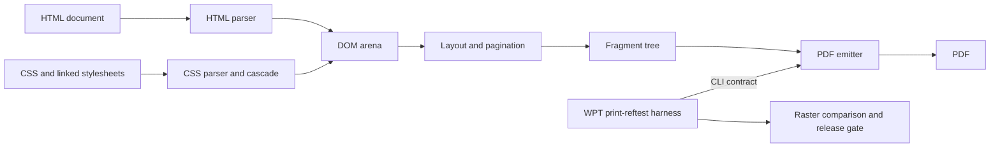
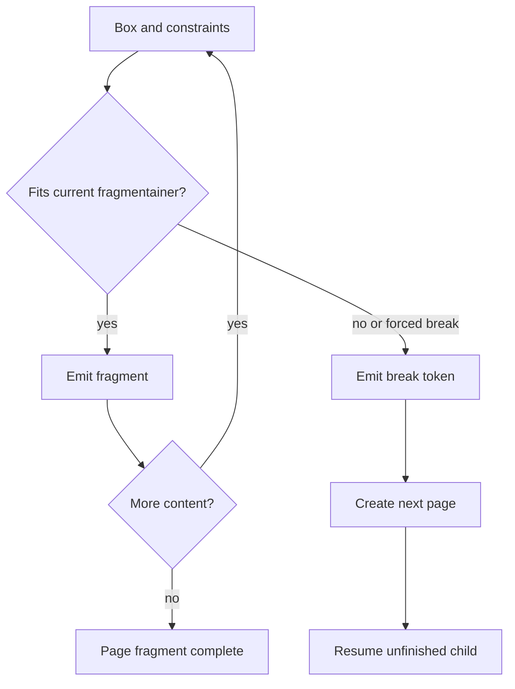

# Typeanvil Architecture

Typeanvil is a batch document compiler. It accepts HTML and CSS, applies
paged-media layout rules, and emits a PDF. The same input and engine version
produce deterministic output. The engine does not run JavaScript and does not
provide browser interaction features.

This document describes the current engine and tooling at the
`release/2026.9` baseline. Future work is labelled as such.

## System shape

The CLI is a thin driver. The Rust library exposes the engine modules so
integration tests can inspect layout and PDF behavior directly.

## Pipeline

### 1. Input and DOM

`engine/src/main.rs` reads the input document and collects inline and linked
stylesheets. `engine/src/dom.rs` parses HTML with `html5ever` into an arena of
root, element, and text nodes. Relative stylesheet, font, and image paths
resolve from the input document or the supplied base URL.

The engine is a static renderer. It does not execute scripts. Network
stylesheet URLs are not fetched by the CLI.

### 2. CSS parsing and computed styles

`engine/src/css.rs` combines stylesheet sources and computes the style values
used by layout. Stylo provides selector matching, inheritance, and computed CSS
values. Typeanvil also has focused parsing passes for paged-media declarations
and engine-specific integration seams.

Layout reads `ComputedStyle` values. It does not read raw CSS declarations
directly. This keeps CSS parsing and layout separate and gives tests a stable
boundary.

CSS specifications define expected behavior. PrinceXML and Chromium are
comparison targets for measured compatibility work.

### 3. Geometry and page setup

`engine/src/geom.rs` stores physical geometry in PostScript points. `Scalar`
wraps controlled `f64` arithmetic and is the central seam for any future
arithmetic change. `PageGeometry` resolves page area, page margins, and the
content rectangle.

`engine/src/paged.rs` resolves `@page`, page selectors, page size, page margins,
page counters, named pages, margin boxes, and print-media behavior.
`engine/src/margin_box.rs` lays out page-edge content such as running headers and
footers.

### 4. Layout and fragmentation

`engine/src/layout.rs` dispatches layout for block, inline, table, flex, grid,
float, multicolumn, and out-of-flow content. Supporting paths live in
`engine/src/layout/`, `table.rs`, and the positioning code.

The output is a fragment tree. A fragment records a box's content, geometry,
and children for the fragmentainer where it appears. A box that crosses pages
can therefore produce fragments on multiple pages.

Break tokens record unfinished work. The next page receives the token and
resumes from the correct child and consumed block size. This avoids treating a
multi-page document as one tall strip that is sliced only during painting.

The fragmentation model supports forced breaks, break avoidance, widows,
orphans, tables, floats, columns, and positioned content according to their
governing specifications. Some interactions remain incomplete and are tracked
by the relevant feature specifications.

### 5. Typography

`engine/src/typography.rs` shapes text with HarfRust and reads font data with
`read-fonts` and `fontdb`. The line-breaking path uses measured glyph advances,
Unicode line-break opportunities, hyphenation, justification, and forced line
breaks. Font selection and bundled fallback faces are defined in
`engine/src/fonts.rs`.

The typography specification contains the contract and current limitations.
Future microtypography work must not be described as shipped behavior until it
has implementation and tests.

### 6. PDF output

`engine/src/pdf.rs` walks the fragment tree and emits PDF through Krilla. The
output path includes text, images, links, outlines, metadata, tagged structure,
and optional PDF/UA validation. `engine/src/tags.rs` handles tagged-PDF
structure. Images are normalized in `engine/src/images.rs` before emission.

The CLI supports PDF metadata, tagged PDF, PDF/UA validation, diagnostics, page
geometry, and a base URL. See [the CLI reference](../operations/cli.md).

## Module map

| Module | Responsibility |
|---|---|
| `main.rs` | CLI parsing and render orchestration |
| `lib.rs` | Public engine module surface |
| `dom.rs` | HTML DOM arena and text access |
| `css.rs` | CSS parsing, cascade, and computed styles |
| `paged.rs` | `@page`, page rules, counters, and print media |
| `geom.rs` | Scalar arithmetic and physical geometry |
| `layout.rs` | Layout dispatch, pagination, and page assembly |
| `layout/` | Flex, grid, and multicolumn layout paths |
| `frag.rs` | Fragments, pages, break tokens, and break appeal |
| `typography.rs` | Shaping, line breaking, hyphenation, and text runs |
| `fonts.rs` | Font faces and font selection |
| `table.rs` | Table measurement, columns, rows, and fragmentation |
| `margin_box.rs` | Page margin-box layout and paint data |
| `images.rs` | Image loading, decoding, and normalization |
| `pdf.rs` | PDF emission and PDF-level features |
| `tags.rs` | Tagged-PDF structure |
| `metadata.rs` | Document metadata extraction |
| `diagnostics.rs` | CSS and render diagnostics |

## Tooling architecture

The Python harness in `harness/` runs WPT print-reftests through the CLI
contract. It renders a test and its reference through the same engine,
rasterizes both PDFs, and compares them with WPT-style fuzzy thresholds. This
is a self-consistency check.

The release gate adds baseline and candidate captures, per-document output
checks, and direct PDF assertions. It is required because a change can affect
both sides of a WPT pair uniformly and leave the pair score unchanged.

The demo corpus compares Typeanvil output with PrinceXML. That comparison
informs compatibility work but does not override CSS specifications.

## Determinism boundary

Determinism depends on stable input bytes, pinned dependency and font data,
controlled geometry arithmetic, stable traversal order, and deterministic PDF
identifiers and metadata. Code that introduces time, randomness,
environment-dependent iteration, or unpinned font selection must document and
test its effect.

## Current boundaries

The current engine does not execute JavaScript, provide browser APIs, support
interactive layout, or promise complete CSS coverage. The repository's feature
specifications define shipped behavior and known gaps. Hosted-service behavior
is outside this repository's documentation scope.

## References

- [Documentation conventions](../conventions/doc-conventions.md)
- [Fragmentation core specification](../specifications/fragmentation-core.spec.md)
- [Typography specification](../specifications/typography-layer.spec.md)
- [WPT conformance harness](../specifications/wpt-conformance-harness.spec.md)
- [CLI reference](../operations/cli.md)
- [Release gate](../operations/release-gate.md)
- [CSS standards alignment](../conventions/css-standards-alignment.md)
- [Rust Book](https://doc.rust-lang.org/book/)
- [CSS Paged Media](https://www.w3.org/TR/css-page-3/)
- [CSS Fragmentation](https://www.w3.org/TR/css-break-3/)