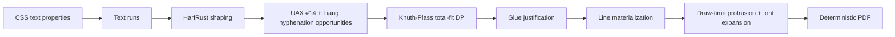

# Typography Quality

Typeanvil's typography pipeline produces the even, crisp texture of
TeX-class typesetting — as the default behavior for every document, not as an
opt-in package. This page explains the algorithmic choices that produce that
quality, what is shipped today, and what is deliberately deferred. The
normative contract lives in the [typography-layer specification](../specifications/typography-layer.spec.md).

## The thesis

Crisp-looking text comes from algorithmic choices, not rendering magic.
Browsers break lines greedily: fill a line, move on, never reconsider. TeX
optimizes break points across the whole paragraph. The result is uniform
inter-word spacing, no rivers, and fewer hyphens. Readers see that even
texture as quality.

Typeanvil ships the optimization approach as the default. It combines:

- **Knuth-Plass total-fit line breaking** with a real glue model
- **Character protrusion** (hanging punctuation)
- **Font expansion** (per-line glyph advance adjustment)
- **Liang hyphenation**
- **Deterministic output** — identical input produces byte-identical PDFs

## Pipeline

## The pillars

### Total-fit line breaking

`engine/src/typography.rs` breaks a paragraph with dynamic programming, not a
greedy first-fit pass. The DP minimizes total demerits across the whole
paragraph. Each candidate line's demerit combines:

- spacing badness — `100·|r|³`, clamped at 10000 (TeX's formula), where `r`
  is the line's adjustment ratio
- the hyphen penalty (135, per Typst)
- the runt penalty (100) for a last line that is too full

The breaker consumes a paragraph's break opportunities as candidates and
chooses the set of breakpoints with the lowest total. A test proves the
result really is total fit: `total_fit_beats_greedy` in
`engine/tests/typography.rs` measures spacing deviation for both algorithms
and asserts the total-fit result beats greedy by a clear margin.

Forced line breaks (` `), `white-space: pre`, and fragmented text runs
that resume across pages all flow through the same breaker.

### Glue model

Every inter-word space has a natural width (the font's space glyph advance)
plus explicit stretch and shrink parameters. A justified line distributes the
excess or deficit over the line's glue with bounded stretch. The glue at a
line's break point is consumed by the break — it contributes neither its
natural width nor its stretch to the line — so justified lines reach the
content edge. This is richer than Typst's `linebreak.rs`, the reference
implementation, which has no glue concept at all.

The `justified_lines_fill_width` test asserts every non-final line's ink
width equals the content width within epsilon.

### Character protrusion

Punctuation at a line edge hangs optically into the margin. A `.` or `,` at
the end of a justified line extends past the content edge by a small
em-fraction, so the optical text block edge looks straight. The default
table covers `. , ; : ! ? - ' " ) ] }` and friends. Protrusion is draw-time
only: it never changes line breaking or measured width.

The `protrusion_hangs` test asserts the trailing punctuation's drawn position
exceeds the content edge by exactly the protrusion amount.

### Font expansion

Within a justified paragraph, the line's glyph advances may be scaled by a
per-line factor in [−2%, +2%] so the line fits the content width exactly.
Expansion is a deterministic post-pass on top of glue stretching, applied
only when it reduces residual error, and clamped at the bound.

The `expansion_applied` test asserts at least one line uses a nonzero factor
within ±2% and residual error is smaller than without expansion.

### Liang hyphenation

Hyphenation is off by default (matching CSS). With `hyphens: auto` or
`hyphenate` enabled, break opportunities come from Knuth-Liang patterns via
the `hypher` crate. Each hyphen opportunity carries the hyphen penalty in
the total-fit objective, so hyphens land where they do least damage to the
paragraph. Existing hyphens in the source text never double up.

### Determinism

All typography passes — shaping, breaking, protrusion, expansion — are pure
functions of their inputs. Identical input produces a byte-identical PDF.
The `determinism_typography` test renders a fixture twice and asserts the
bytes match.

TeX achieves determinism with fixed-point arithmetic (scaled points).
Typeanvil uses controlled `f64` arithmetic behind the `Scalar` type.
Determinism today comes from pinned fonts, stable traversal order, and
deterministic geometry arithmetic. `Scalar` is the documented seam for any
future arithmetic change.

## How quality is verified

Two layers prove the behavior:

1. **Spec-mapped unit and integration tests.** The typography-layer
   specification's acceptance criteria map one-to-one onto tests in
   `engine/tests/typography.rs`: `shaping_real_widths`,
   `justified_lines_fill_width`, `total_fit_beats_greedy`,
   `hyphenation_breaks`, `protrusion_hangs`, `expansion_applied`,
   `uax14_opportunities`, `determinism_typography`, plus forced-break and
   `white-space` cases.
2. **The comparison corpus.** The [visual comparison demo](../specifications/visual-comparison-demo.spec.md)
   renders the same documents through TypeAnvil and Prince 16.2 and shows
   the pages side by side in the [corpus gallery](../../demo/corpus/README.md).
   Typography-focused fixtures render at page-count parity with Prince. In
   that comparison, Prince does not implement Knuth-Plass protrusion to the
   same spec — hanging punctuation is a Typeanvil advantage.

## Shipped vs deferred

**Shipped (as of `release/2026.10`):** HarfRust shaping with real glyph
advances; total-fit line breaking with glue; UAX #14 break opportunities
(via the pure-Rust `unicode-linebreak` stand-in, a documented deviation);
Liang hyphenation; forced breaks and `white-space: pre`; protrusion with the
default character table; per-line font expansion within ±2%; deterministic
PDF output.

**Deferred (deliberately out of scope):**

- per-locale protrusion tables and kerning expansion classes (the full
  `microtype` package feature set)
- bidi and complex-script reordering beyond what HarfRust does by default
- variable fonts and font fallback across a collection (a single embedded
  font remains the baseline)
- hyphenation dictionary parity with any specific comparison engine

## References

- [Typography layer specification](../specifications/typography-layer.spec.md) — the behavior contract and acceptance criteria
- [Architecture overview](overview.md) — engine pipeline and module map
- [Visual comparison demo specification](../specifications/visual-comparison-demo.spec.md) — the Prince comparison method
- Knuth & Plass, "Breaking Paragraphs into Lines" (1981)
- Typst `typst-layout/src/inline/linebreak.rs` — the K-P reference implementation
- W3C css-text-3 (`text-align`, `text-justify`, `hyphens`, `overflow-wrap`)
- Unicode UAX #14 — line breaking rules
