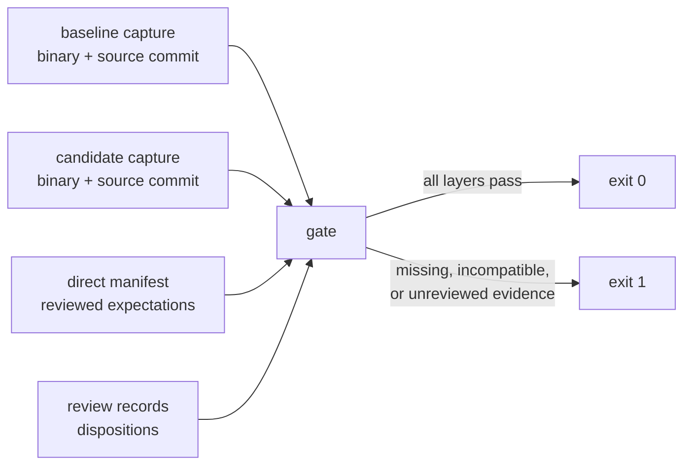

# Harness Release Gate

## Overview

The conformance harness compares our render of a test against our render of that
test's reference, through the same engine. A change that moves both documents the
same way leaves the pair matching, so the score stays flat while the output
changes. That is a measured failure, not a theory: an interior `vertical-rl` fill
experiment moved a Chromium-verified document from one page to two, and the full
283-test comparison reported zero flips.

This spec adds a release gate with three separate evidence layers:

1. **WPT pair score** — the existing rule. Unchanged.
2. **Per-document output comparison** — each rendered document is compared with
   its own earlier output, with explicit baseline and candidate identities.
3. **Direct PDF assertions** — a small reviewed corpus checked against expected
   page geometry, text, paint, and links.

The gate passes only when all three layers pass and every output change carries a
recorded disposition.



## Goals / Non-Goals

**Goals**

- Catch a rendering change that the pair comparison hides.
- Make every comparison explicit: which binary, which source commit, which WPT
  revision, which documents, which settings.
- Refuse to pass when required evidence is missing, stale, or incompatible.
- Assert properties of the emitted PDF directly, so correctness does not depend
  on two documents being wrong in the same way.
- Keep the existing WPT score semantics and its recorded history intact.

**Non-Goals**

- Replacing the WPT pair score. The pair remains the conformance measure.
- A cross-engine pixel-equality policy. Full-page Chromium or Prince equality is
  not an acceptance rule.
- Widening or auto-tuning tolerances.
- New engine capability. Unsupported vertical or stacking behavior stays with
  its own capability ticket.
- Rebaselining known failures in bulk.

## Behavior

The harness shall:

### A. Preserve the WPT score

1. Keep the authored match, mismatch, fuzzy, page-selection, multiple-reference,
   and chained-reference semantics exactly as the WPT conformance harness spec
   defines them.
2. Report WPT status movement separately from direct-check results and from
   output-change review. An output change shall not alter a WPT status.
3. Treat an expected WPT failure as a policy question, never as a harness error
   and never as a missing check.

### B. Explicit identity and complete evidence

4. Record an identity block with every capture: capture schema version, engine
   kind, source commit, binary identity (SHA-256 plus the version the binary
   reports), WPT revision, page geometry, capture DPI, rasterizer identity, and
   font identity.
5. Provide `baseline` as an explicit separate operation. It shall record a
   capture and shall never report a release-gate pass.
6. Require explicitly named baseline and candidate artifacts. The gate shall not
   select runs by recency and shall not read a database as its evidence source.
7. Capture every document in the selected set: each test document and every
   reference document, including chained references, even when WPT evaluation
   short-circuits.
8. Refuse to pass, with a nonzero exit status and a named failing condition, when
   any of these hold: missing baseline, missing candidate, empty selection,
   duplicate document identity, differing coverage sets, an interrupted capture,
   an unsupported capture schema version, an unapproved ERROR or SKIP result, an
   incompatible environment identity, or a changed document without an applied
   disposition.
9. Compare environment identity between baseline and candidate on page geometry,
   capture DPI, engine kind, WPT revision, rasterizer identity, and font
   identity. Source commit and binary identity shall differ between a real
   baseline and a real candidate, and each side's value shall be recorded.
10. Report a record without sufficient metadata as unverifiable. The gate shall
    not infer legacy records as verified.

### C. Compare each document with its own earlier output

11. Record, for every captured document: page count, each page's size in PDF
    points, and a per-page fingerprint of the rasterized page at the capture DPI.
12. Compare baseline test to candidate test, and baseline reference to candidate
    reference, per document identity.
13. Deduplicate documents by relative path, document content hash, and settings
    identity. A document shared by several tests shall be captured once.
14. Produce a durable review artifact for every changed document. The artifact
    shall name the document, the changed property, and both values.
15. Require a recorded disposition for every change: `correction`, `regression`,
    or `variation`. The gate shall fail while a change has no disposition, and
    while a change carries a `regression` disposition.
16. Bind a disposition to the exact baseline and candidate fingerprints of that
    change. When either fingerprint changes, the earlier disposition shall not
    apply and the change shall block again.
17. Accept a spec-correct `correction` without restoring an old defect. The gate
    shall not update expected artifacts, approve candidate output, or widen a
    tolerance by itself.

### D. Assert against the emitted PDF

18. Assert direct checks on generated PDFs, independent of any test-versus-
    reference comparison.
19. Read the direct checks from one reviewed, tracked manifest. Each entry shall
    name its input, the check, the expected value, and its provenance.
20. Require the provenance to be a specification citation or reviewed evidence
    with a recorded source. An entry without provenance shall fail the gate.
21. Include this initial corpus:
    - the orthogonal-writing one-page shape;
    - an absolute-positioned control with nonzero margins and explicit page and
      box coordinates;
    - required text presence;
    - page size and page count;
    - a paint-region or text-orientation control;
    - a small invoice and report corpus, checked for preserved text and rows and
      for applicable link destinations and rectangles.
22. Fail the gate on any direct-check failure published as a real failure. A
    synthetic fault test proves the mechanism and shall be labeled synthetic. It
    shall not be reported as an engine conformance result.

### E. Integrate and bound the cost

23. Provide one documented command for the combined gate: WPT score comparison,
    per-document output comparison, and direct checks.
24. Return a nonzero exit status when a gate condition fails.
25. Reference the gate from the landing and release procedure documents, and
    point the CORE-203 and CORE-204 landing requirements at it.
26. Define two tiers. The engine-change tier runs the direct checks and a bounded
    coverage subset. The promotion tier runs the full selected set. Each tier
    shall record its measured runtime and artifact size.
27. Reuse captured renders and shared reference documents when their identity
    matches. The gate shall not require a fresh browser-oracle run per fixture
    per commit.

## Interfaces

**CLI** (`python -m harness`):

| Command | Flags | Purpose |
|---|---|---|
| `baseline` | `--engine {chromium,cli}` `--cli-cmd` `--label` `--out` `--filter` `--limit` `--workers` `--dpi` `--source-commit` | render the selection and record a baseline capture; never a gate result |
| `gate` | `--baseline` `--candidate` `--direct` `--reviews` `--policy` `--out` `--allow-change` | compare two captures plus direct checks; nonzero unless every condition passes |

Exit codes: `0` pass, `1` gate failure, `2` usage or environment error.

**Capture file** (`gate/captures/<label>.json`, not committed):

```json
{
  "schema": "typeanvil.harness.capture/1",
  "label": "baseline-2026-09-15",
  "complete": true,
  "identity": {
    "engine_kind": "cli",
    "cli_cmd": "engine/target/debug/typeanvil render",
    "source_commit": "a96a6aa",
    "binary": {"path": "engine/target/debug/typeanvil", "sha256": "...", "version": "..."},
    "wpt_revision": "...",
    "page_spec": {"width_in": 5.0, "height_in": 3.0, "margin_top_in": 0.5,
                  "margin_right_in": 0.5, "margin_bottom_in": 0.5, "margin_left_in": 0.5},
    "dpi": 96,
    "rasterizer": "pypdfium2 4.x",
    "fonts": {"identity": "...", "source": "engine-diagnostics"}
  },
  "selection": ["css-page/page-name-orthogonal-writing-004-print.html"],
  "documents": [
    {
      "doc_id": "css-page/support/ref.html",
      "role": ["reference"],
      "content_sha256": "...",
      "page_count": 1,
      "pages": [{"index": 0, "size_pt": [360.0, 216.0], "fingerprint": "...",
                 "thumbnail": "<base64 PNG, downscaled greyscale>"}],
      "render_failed": false
    }
  ],
  "results": [{"id": "css-page/x-print.html", "status": "PASS"}]
}
```

**Review record** (`gate/reviews/<candidate-label>.json`, committed):

```json
{
  "schema": "typeanvil.harness.reviews/1",
  "candidate": {"label": "candidate-2026-09-15", "source_commit": "...", "binary_sha256": "..."},
  "baseline": {"label": "baseline-2026-09-15", "source_commit": "...", "binary_sha256": "..."},
  "dispositions": [
    {"doc_id": "css-page/x-print.html",
     "change_id": "...",
     "kind": "correction",
     "reason": "spec-cited reason",
     "provenance": "docs/specifications/... §N"}
  ]
}
```

`change_id` is derived from the document identity and both fingerprints, so a
record cannot approve a change it did not review.

Each page also carries a downscaled greyscale thumbnail. It is review evidence:
the gate writes one side-by-side image per changed document (baseline |
candidate) from the stored thumbnails, so a reviewer can see the difference
without re-rendering the baseline. The thumbnail is never compared; the
fingerprint is the comparison.

Every capture command takes `--wpt` as a **global** flag before the subcommand
(`python -m harness --wpt /main/.wpt baseline ...`), matching the existing `run`
command. `--wpt` is not accepted after the subcommand.

**Direct manifest** (`harness/direct_manifest.json`, tracked):

```json
{
  "schema": "typeanvil.harness.direct/1",
  "checks": [
    {"id": "orthogonal-one-page",
     "input": "css-page/page-name-orthogonal-writing-004-print.html",
     "input_source": "wpt",
     "page_count": 1,
     "provenance": "docs/research/wpt-harness/core182-interior-writing-mode-scoping.md"}
  ]
}
```

Check keys: `page_count`, `page_size_pt`, `text_present`, `text_absent`,
`paint_region`, `text_orientation`, `link_target`.

`rect_pt` uses points with a top-left origin, x to the right and y downward, the
same orientation as the rasterized page. `paint_region` measures the fraction of
dark pixels inside the rectangle.

`text_orientation` sums the absolute centre-to-centre delta along x, and along y,
for consecutive glyphs inside the rectangle, and reports the larger axis.
Summing glyph box widths is not equivalent: a horizontal line of text has taller
boxes than wide ones, so that comparison reports horizontal text as vertical
(measured 2026-09-15). An expectation that carries no recognised check key is an
error, never a silent pass.

`link_target` reads the URI from the link annotation's action, which is UTF-8.
The page-link web-link API returns a different handle type and a different
encoding, so it cannot read an annotation's target.

The scoreboard's `score --gate` keeps its current meaning: it compares the latest
two recorded runs and selects them by recency. The release gate requires
explicitly named baseline and candidate captures.

## Acceptance Criteria

Each item maps to a real test in `tests/`. Fault tests are labeled synthetic and
use synthetic captures. They are not engine conformance results.

1. **Shared error is caught** — Given a synthetic baseline and candidate where
   both the test document and the reference document move from one page to two
   while every WPT status stays `PASS`, when the gate runs, then it fails and
   names both changed documents
   (`test_gate.py::test_shared_page_count_change_blocks_gate`).
2. **Direct PDF faults are caught** — Given a rendered PDF with required text
   removed, when the direct check runs, then it fails; given a wrong paint region
   or text orientation, then it fails
   (`test_direct.py::test_missing_text_detected`, `test_direct.py::test_paint_region_mismatch_detected`,
   `test_direct.py::test_text_orientation_mismatch_detected`).
3. **Incomplete evidence blocks** — Given a missing baseline, a missing
   candidate, an empty selection, a duplicate document identity, a coverage
   mismatch, an interrupted capture, an unsupported schema version, an
   unapproved ERROR or SKIP result, or an incompatible environment identity, when
   the gate runs, then it exits nonzero and names the condition
   (`test_gate.py` — one parametrized case per condition).
4. **Unchanged compatible control passes** — Given a baseline and a candidate
   with equal identity-compatible settings and identical output, when the gate
   runs, then it passes without a review record
   (`test_gate.py::test_unchanged_control_passes`).
5. **Changes need a bound disposition** — Given a changed document, when no
   disposition exists, then the gate fails; when a `correction` disposition
   bound to both fingerprints exists, then it passes; when a fingerprint later
   changes, then the same record no longer applies and the gate fails
   (`test_gate.py::test_disposition_required_and_bound`).
6. **WPT semantics unchanged** — Given the existing harness test suite, when it
   runs, then the match, mismatch, fuzzy, page-selection, and reference-chain
   cases pass with unchanged meaning
   (`test_compare.py`, `test_fuzzy.py`, `test_reftest_pages.py`,
   `test_manifest.py`, `test_report.py`).
7. **Real evidence recorded** — Given freshly built baseline and candidate
   binaries, when both run through the integrated workflow, then the issue
   records the commands, source and binary identities, complete reports, review
   records, output artifacts, measured runtime, and artifact size.
8. **Docs validate** — the new spec, the updated harness spec, the runbook, and
   the landing procedure pass `scripts/validate_docs.py`.

## Edge Cases

- **Document shared by several tests** → captured once; the coverage report lists
  every test that references it.
- **`rel=mismatch` pair** → both documents are captured; capture is independent
  of the relation.
- **Document that fails to render** → recorded with `render_failed`; the gate
  blocks unless the document id appears in the approved policy.
- **Equal page count, different page size** → blocks; page size is captured per
  page.
- **Candidate bytes identical to baseline** → no changes, gate passes without a
  review record.
- **Repeated gate run on the same evidence** → same verdict; the gate writes no
  new state on a passing verdict.
- **Empty selection** → fails as an empty selection; an empty run is not a pass.
- **Font identity unavailable** → recorded as `unknown`; the gate refuses to
  pass and asks for an explicit acknowledgement.
- **Legacy capture without an identity block** → unverifiable, never inferred as
  verified.

## Cost and tiers

| Tier | Coverage | Purpose |
|---|---|---|
| engine-change | direct checks plus a bounded document subset | every engine commit |
| promotion | the full selected set | before promotion to main |

The gate records the runtime and artifact size of each tier. Captured renders are
reused while their identity matches: the same document content, settings, and
binary identity produce the same fingerprints.

## References

- [WPT Conformance Harness](wpt-conformance-harness.spec.md) — the pair score
  this gate extends.
- [Issue evidence and diagnosis](../conventions/issue-evidence.md) — required
  evidence fields.
- [Review issue evidence](../operations/issue-evidence-review.md) — the review
  step for pair matches that look wrong.
- [Release gate runbook](../operations/release-gate.md) — commands and steps.
- [CSS standards alignment](../conventions/css-standards-alignment.md) — the
  spec-wins rule for disputed behavior.
- `docs/research/wpt-harness/core182-interior-writing-mode-scoping.md` — the
  measured shared-error case.
- CORE-206 (this gate), CORE-203 and CORE-204 (consumers).
