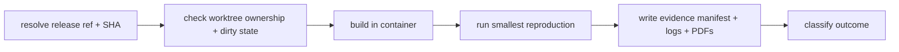

# Issue pickup command

## Overview

Issue pickup currently repeats setup failures across sessions: worktrees created
from the wrong branch point, host-path polling for a container-built binary,
outputs lost in container `/tmp`, guessed probe interfaces, and evidence that
does not survive the container exit. This spec defines one small supported
entry point that wraps the existing Docker wrapper (`scripts/dev-container.sh`)
and the existing harness, rather than reimplementing their behavior.

The command collects evidence. Causal interpretation and specification
decisions stay with the agent. A completed run is evidence about a reproduction;
it is never a correctness or landing-gate pass.



## Goals / Non-Goals

**Goals**

- Resolve the active release ref and exact source SHA explicitly, and fail
  clearly on ambiguity.
- Check worktree/source ownership and dirty state before creation or reuse.
- Start the fresh build early, read its real exit status, and retain an
  unfiltered log. Never poll a host path for a container binary.
- Support a concrete HTML reproduction and an exact expected WPT-ID selection.
  Verify selected test/reference coverage; reject zero tests and unexpectedly
  broad substring matches.
- Save separate build/run statuses and logs, persistent PDFs, measured outputs,
  and a compact evidence manifest in a non-overwriting directory.
- Record source SHA, dirty-state/patch identity, fixture/WPT/assets identity,
  binary hash, container/toolchain, fonts, page geometry and browser
  preferences, renderer/rasterizer, DPI, command, and timestamps. Mark unknown
  values explicitly.
- Distinguish reproduced expected failure, passing reproduction, build failure,
  crash, missing dependency, and empty selection.
- Skip engine work for documentation-only tasks. Provide usable non-interactive
  status/progress output.

**Non-Goals**

- Reimplementing the Docker wrapper or the harness. The command calls them.
- Making causal judgments or specification decisions.
- Replacing the full change gate. A pickup reproduction is a targeted probe.
- Automatic expectation updates, rebaselining, or tolerance widening.
- Engine behavior changes, other-profile edits, upstream filings, or main
  promotion.

## Behavior

The pickup command shall:

### A. Resolve the branch point

1. Accept an explicit release ref (default `release/2026.9`) and resolve it to
   an exact source SHA with `git rev-parse origin/<ref>` after `git fetch
   origin`. Fail clearly when the ref does not resolve.
2. Accept an explicit worktree path. If the worktree exists, verify its HEAD
   equals the resolved SHA (or an explicitly supplied `--source-commit`).
   Fail on a mismatch rather than silently reusing a stale tree.
3. Check the worktree's dirty state with `git status --porcelain`. Record it.
   Refuse to build in a dirty worktree unless `--allow-dirty` is given, and
   record the patch identity when allowed.
4. Never reset, rebase, or edit another session's live tree.

### B. Build in the container

5. Invoke the fresh build through `scripts/dev-container.sh` early, before any
   rendering. Use `cargo build --manifest-path /work/engine/Cargo.toml -j 2`.
6. Capture the build's real exit status and an unfiltered log to separate
   files. Do not hide failure in a shell pipeline and do not poll a host path
   for a container binary.
7. Stop with a `build_failed` outcome when the build exits nonzero. Do not
   render or report a test result after a failed build.

### C. Run the smallest reproduction

8. Accept exactly one of: a concrete HTML input path, or an exact expected
   WPT-ID selection.
9. For a WPT selection, resolve the exact ID against the manifest. Reject a
   selection that matches zero tests. Reject a substring that matches more than
   one test as unexpectedly broad. Verify that the selected test's reference
   exists.
10. For an HTML input, render that single document through the CLI engine and
    save the PDF.
11. Run the reproduction through the harness `run` command with the container
    binary, `--workers 1`, and the exact filter. Save the report, history, and
    artifacts under the evidence directory.

### D. Record evidence

12. Write a compact evidence manifest (JSON) with: source SHA, dirty-state/patch
    identity, fixture/WPT/assets identity, binary hash, container/toolchain,
    fonts, page geometry and browser preferences, renderer/rasterizer, DPI,
    command, and timestamps. Mark unknown values explicitly as `unknown`.
13. Write separate build/run statuses and logs, persistent PDFs, and measured
    outputs into a non-overwriting directory (a fresh timestamped subdirectory
    per run). Artifacts survive the container exit because they are written
    under the mounted worktree.
14. Classify the outcome as one of: `reproduced_expected_failure`,
    `passing_reproduction`, `build_failed`, `crash`, `missing_dependency`,
    `empty_selection`, or `docs_only`. A completed execution never implies a
    correctness or landing-gate pass.

### E. Documentation-only tasks

15. Accept a `--no-engine` flag that skips the build and reproduction, still
    validates a named WPT selection when one is given, and records only the
    source/evidence identity with outcome `docs_only`. Use it for
    documentation-only tasks.

## Interfaces

**CLI** (`python3 scripts/pickup.py`):

| Flag | Purpose |
|---|---|
| `--worktree` | path to the worktree (required) |
| `--release-ref` | release ref to resolve (default `release/2026.9`) |
| `--source-commit` | explicit source SHA override (optional) |
| `--issue` | issue identifier, used in the evidence directory name |
| `--html` | concrete HTML input to render (exactly one of `--html`/`--wpt-id`) |
| `--wpt-id` | exact expected WPT test ID (exactly one of `--html`/`--wpt-id`) |
| `--out` | evidence root directory (default `probe/issue-evidence`) |
| `--allow-dirty` | permit building in a dirty worktree |
| `--no-engine` | documentation-only: skip build and reproduction |
| `--wpt` | WPT checkout path (default `/main/.wpt` inside the container) |

Exit codes: `0` success, `1` reproduction/build failure, `2` usage or
environment error.

**Evidence manifest** (`<out>/<issue>/<commit>.<timestamp>/evidence.json`):

```json
{
  "schema": "typeanvil.pickup/1",
  "issue": "CORE-<id>",
  "outcome": "reproduced_expected_failure",
  "source": {"commit": "...", "dirty": false, "patch_identity": null},
  "binary": {"path": "...", "sha256": "...", "version": "..."},
  "wpt": {"revision": "...", "selection": ["css-page/x-print.html"]},
  "environment": {"container": "typeanvil-dev", "fonts": "unknown",
                  "page_spec": {...}, "dpi": 96,
                  "rasterizer": "pypdfium2 ..."},
  "command": "python3 scripts/pickup.py ...",
  "timestamps": {"started": "...", "build_finished": "...", "finished": "..."}
}
```

## Acceptance Criteria

Each criterion maps to a test in `tests/test_pickup.py` or a recorded real run.

1. **Branch point resolved** — Given a resolvable release ref, the command
   records the exact SHA; given an unresolvable ref, it exits 2 with a clear
   message.
2. **Worktree ownership checked** — Given a worktree whose HEAD differs from
   the resolved SHA, the command fails rather than reusing it; given a dirty
   worktree without `--allow-dirty`, it fails and records the dirty state.
3. **Build status read, not polled** — Given a failing build, the command
   records `build_failed` and does not render; the unfiltered log is retained.
4. **Selection validated** — Given a WPT ID that matches zero tests, the command
   rejects it as empty; given a substring matching several tests, it rejects it
   as broad; given an exact ID with an existing reference, it runs.
5. **Evidence survives** — Given a completed run, the evidence directory holds
   the manifest, build/run logs and statuses, and the PDF, all under the mounted
   worktree.
6. **Outcome classified** — Given a passing reproduction, the outcome is
   `passing_reproduction`; given an expected failing test, it is
   `reproduced_expected_failure`; a completed run is never reported as a gate
   pass.
7. **Docs-only skip** — Given `--no-engine`, the command records identity and
   skips the build and reproduction.
8. **Docs validate** — the spec and the updated runbook pass
   `scripts/validate_docs.py`.

## Edge Cases

- **Worktree does not exist** → the command fails with a clear message; it does
  not create a worktree (creation stays with the agent, which checks ownership
  first).
- **Both `--html` and `--wpt-id` given** → usage error (exit 2).
- **Neither given** → usage error (exit 2).
- **WPT checkout missing** → `missing_dependency` outcome.
- **Engine crashes on render** → `crash` outcome, recorded with the traceback.
- **Empty selection** → `empty_selection`; an empty run is not a pass.
- **Font identity unavailable** → recorded as `unknown`, never guessed.

## References

- [Issue evidence and diagnosis](../conventions/issue-evidence.md) — required
  evidence fields.
- [Review issue evidence](../operations/issue-evidence-review.md) — the review
  step this command accelerates.
- [Dev container runbook](../operations/dev-container.md) — the wrapper this
  command calls.
- [Harness release gate](harness-release-gate.spec.md) — the full change gate
  this command does not replace.
- [WPT conformance harness](wpt-conformance-harness.spec.md) — the harness this
  command drives.
- This spec (`docs/specifications/issue-pickup.spec.md`),
  `docs/conventions/issue-evidence.md` (evidence rules), and
  `docs/specifications/harness-release-gate.spec.md` (release gate).
